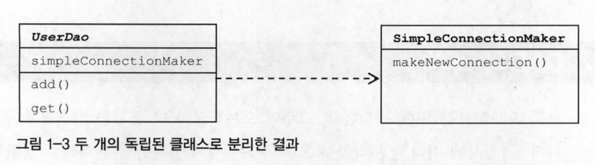
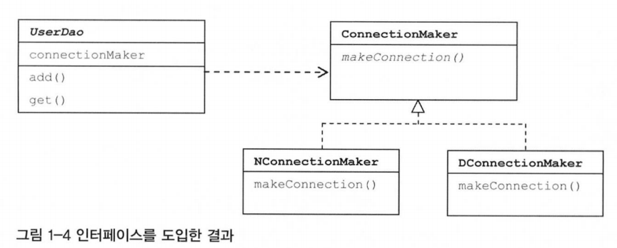
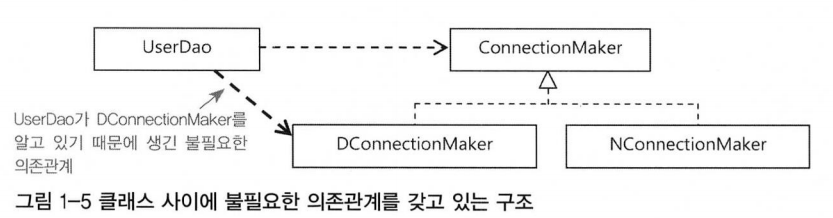
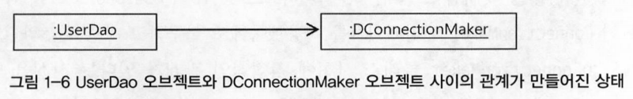
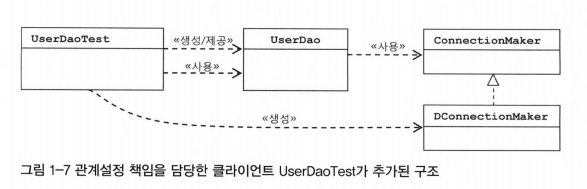

# 1장 오브젝트와 의존관계

## 1.3 DAO의 확장

### 1.3.0 들어가기

- 관심사에 따라 분리한 오브젝트들은 제각기 독특한 변화의 특징이 있음, 변화의 성격이 다르다는 건 변화의 이유와 시기, 주기 등이 다르다는 뜻
- 추상 클래스를 만들고 이를 상속한 서브 클래스에서 변화가 필요한 부분을 바꿔서 쓸 수 있게 만든 이유
  - 변화의 성격이 다른 것을 분리해서, 서로 영향을 주지 않은 채로 각각 필요한 시점에 독립적으로 변경할 수 있게 하기 위해

### 1.3.1 클래스의 분리 

- 기능에 변화가 없다: 리팩토링 작업의 전제이기도 하지만 검증 내용이기도 함
- 관심사를 분리하는 작업
  - 독립적인 메소드 분리 → 상하위 클래스 분리 → 독립적인 클래스 분리
  - 클래스를 분리한 경우에도, 상속과 동일하게 자유로운 확장이 가능하려면 문제 해결 필요
  	- 사용하는 다른 클래스에서도 동일한 메소드를 볼 수 있게 공통화 필요
  	- 사용하는 클래스에서 사용되는 클래스가 어떤것인지 구체적으로 알아야 함
  	- 사용되는 오브젝트를 **서비스**, 사용하는 오브젝트를 **클라이언트**라고 부름
  - 해결 방안: 두 개의 클래스가 서로 긴밀하게 연결되어 있지 않도록, 중간에 추상적인 느슨한 연결 고리를 만들어주는 것

## 1.3.2 인터페이스의 도입

  
  

- **추상화 (abstract)**
  - 어떤 것들의 공통적인 성격을 뽑아내어 따로 분리해내는 작업
  - 자바에서 추상화를 위해 제공하는 가장 유용한 도구는 인터페이스
- **인터페이스 (interface)**
  - 자신을 구현한 클래스에 대한 구체적인 정보는 모두 감춤
  - 오브젝트를 만들려면 구체적인 클래스 하나를 선택해야 하지만, 인터페이스로 추상화를 진행한 경우
    - 최소한의 통로를 통해 접근하는 쪽에서 오브젝트를 만들 때, 사용할 클래스가 무엇인지 몰라도 가능
  - 인터페이스를 통해 접근하게 하면 실제 구현 클래스를 바꿔도 신경 쓸 일이 없음
  - 어떤 일을 하겠다는 기능만 정의, 어떻게 하겠다는 구현 방법은 나타나 있지 않음, 인터페이스를 구현한 클래스들이 알아서 결정함

### 1.3.3 관계설정 책임의 분리

- 클래스가 아니라 오브젝트와 오브젝트 사이의 관계를 설정 필요
  - 클래스 사이의 관계
    - 클래스 사이의 관계가 만들어진다는 것은 **한 클래스가 인터페이스 없이 다른 클래스를 직접 사용**한다는 의미
    - 코드에 다른 클래스 이름이 나타나기 때문에 만들어짐
  - 오브젝트 사이의 관계
    - 런타임 시에 한쪽이 다른 오브젝트의 레퍼런스를 갖고 있는 방식으로 만들어짐
    - 직접 생성자를 호출해서 직접 오브젝트를 만드는 방법
      - 두 개의 오브젝트가 '사용'이라는 관계를 맺음
      - `ConnectionMaker connectionMaker = new DConnectionMaker();`
    - 외부에서 만들어준 것을 가져오는 방법 (메소드 파라미터, 생성자 파라미터 이용)
      - 해당 인터페이스 타입의 오브젝트라면 파라미터로 전달 가능
      - 파라미터로 제공 받은 오브젝트는 인터페이스에 정의된 메소드만 이용 시, 오브젝트가 어떤 클래스로부터 만들어졌는지 신경 쓰지 않아도 됨
    - 오브젝트 사이의 관계는 코드에서는 특정 클래스를 전혀 알지 못하더라도 해당 클래스가 구현한 인터페이스를 사용했다면, 그 클래스의 오브젝트를 인터페이스 타입으로 받아 사용 가능
    - 런타임 시점에 코드에서는 보이지 않았던 관계가 오브젝트로 만들어진 후에 생성
    - **클라이언트의 책임**: 런타임 오브젝트 관계를 갖는 구조를 만들게 하는 것

  
  
  

- **다형성 (polymorphism)**
  - 코드에서는 특정 클래스를 전혀 알지 못하더라도 해당 클래스가 구현한 인터페이스를 사용했다면, 그 클래스의 오브젝트를 인터페이스 타입으로 받아서 사용 가능
  - 여러 형태를 가질 수 있다는 뜻, 객체 지향 프로그래밍의 주요 원칙 중 하나
  - 다형성을 통해 여러 객체가 동일한 인터페이스를 공유하면서도 각자의 고유한 방식으로 해당 인터페이스를 구현 가능
  - 인터페이스를 도입하고 클라이언트의 도움을 얻는 방법 → 상속을 사용해 비슷한 시도를 했을 경우에 비해 훨씬 유연함

### 1.3.4 원칙과 패턴

- **객체지향 설계 원칙 (SOLID)**
  - 객체지향의 특징을 잘 살릴 수 있는 설계의 특징
  - 원칙이라는 건 어떤 상황이든 100% 지켜져야 하는 절대적인 기준이라기보다는 예외는 있겠지만 대부분 상황에 잘 들어맞는 가이드라인과 같음
  - 디자인 패턴은 특별한 상황에서 발생하는 문제에 대한 좀 더 구체적인 솔루션이라면, 객체지향 설계원칙은 더 일반적인 상황에서 적용 가능한 설계 기준
  - 객체지향 디자인 패턴은 대부분 객체지향 설계 원칙을 잘 지켜서 만들어짐
  - **단일 책임 원칙 (SRP, Single Responsibility Priciple)**
    - 한 클래스는 하나의 책임만 가짐
    - 클래스가 변경되어야 하는 이유는 하나뿐이어야 함
  - **개방 폐쇄 원칙 (OCP, Open-Closed Principle)**
    - 클래스나 모듈은 확장에는 열려 있어야 하고, 변경에는 닫혀 있어야 함 → **수정하지 않으면서 기능은 확장**
    - 인터페이스를 통해 제공되는 확장 포인트는 확장을 위해 개방되어 있음
      - 반면 인터페이스를 이용하는 클래스는 자신의 변화가 불필요하게 일어나지 않도록 굳게 폐쇄되어 있음
    - 잘 설계된 객체지향 클래스의 구조를 보면 개방 폐쇄 원칙을 잘 지키고 있음
    - 높은 응집도와 낮은 결합도(high coherence and low coupling), 소프트웨어 개발의 고전적인 원리로도 설명 가능
  - **리스코프 치환 원칙 (LSP, Liskov Substitution Priciple)**
    - 서브타입은 그 기본 타입으로 치환될 수 있어야 함
    - 자식 클래스는 부모 클래스의 역할을 그대로 수행할 수 있어야 함
    - 자식 클래스는 부모 클래스의 기능을 손상시키거나 변경하지 않아야 한함
  - **인터페이스 분리 원칙 (ISP, Interface Segregation Priciple)**
    - 클라이언트는 자신이 사용하지 않는 인터페이스에 의존하면 안 됨
    - 많은 기능을 갖는 하나의 큰 인터페이스보다는 구체적인 여러 인터페이스가 더 나음
  - **의존관계 역전 원칙 (DIP, Dependency Inversion Priciple)**
    - 고차원 모듈은 저차원 모듈에 의존하면 안 됨, 둘 다 추상화에 의존해야 함
    - 추상화는 세부 사항에 의존하면 안 됨, 세부 사항이 추상화에 의존해야 함
    - 구체적인 구현보다는 추상화된 인터페이스나 기본 클래스에 의존하는 것이 좋음
- 높은 응집도와 낮은 결합도
  - 응집도가 높다는 것은 하나의 모듈, 클래스가 하나의 책임 또는 관심사에만 집중됨
  - 불필요하거나 직접 관련이 없는 외부의 관심과 책임이 얽혀 있지 않으며, 하나의 공통 관심사는 한 클래스에 모여 있음
  - 높은 응집도는 클래스 레벨 뿐 아니라, 패키지, 컴포넌트, 모듈에 이르기까지 대상의 크기가 달라도 동일한 원리로 적용 가능
  - 응집도가 높다는 것은 변화가 일어날 때, 해당 모듈에서 변하는 부분이 크다는 것으로 설명 가능
  - 변경이 일어날 때 모듈의 많은 부분이 함께 바뀐다면 응집도가 높다고 말할 수 있음
  - 모듈의 일부만 변경이 일어나도 된다면, 모듈 전체에서 어떤 부분이 바뀌어야 하는지 파악 필요
    - 그 변경으로 인해 바뀌지 않는 부분에는 다른 영향을 미치지 않는지 확인해야 하는 부담이 생김
  - 작업은 항상 전체적으로 일어나고 무엇을 변경할지 명확하게 다른 클래스의 수정을 요구하지 않을 뿐더러, 기능에 영향을 주지 않는다는 사실을 확인 가능
  - **낮은 결합도는 높은 응집도보다 더 민감한 원칙**, 책임과 관심사가 다른 오브젝트 또는 모듈과 낮은 결합도, 느슨하게 연결된 형태를 유지하는 것이 바람직함
  - 느슨한 연결은 관계를 유지하는데 꼭 필요한 최소한의 방법만 간접적인 형태로 제공, 나머지는 독립적이고 알 필요도 없게 만들어주는 것
  - **결합도가 낮아지면 변화에 대응하는 속도가 높아지고 구성이 깔끔해짐, 확장하기에도 매우 편리**
  - **결합도**: 하나의 오브젝트가 변경이 일어날 때 관계를 맺고 있는 다른 오브젝트에게 변화를 요구하는 정도
  - 낮은 결합도란 하나의 변경이 발생할 때, 다른 모듈과 객체로 변경에 대한 요구가 전파되지 않는 상태
  - 결합도가 높아지면 변경에 따르는 작업량이 많아지고, 변경으로 인해 버그 발생 가능성이 높아짐
- **전략 패턴 (Strategy Pattern)**
  - 자신의 기능, 컨텍스트에서 필요에 따라 변경이 필요한 알고리즘을 인터페이스를 통해 외부로 분리
  - (대체 가능한) 전략, 디자인 패턴의 꽃, 개방 폐쇄 원칙(OCP)의 실현에도 가장 잘 들어 맞는 패턴
  - 구현한 구체적인 알고리즘 (독립적인 책임으로 분리가 가능한 기능) 클래스를 필요에 따라 변경하여 사용 할 수 있음
  - 클라이언트의 역할
    - 컨텍스트(UserDao)를 사용하는 클라이언트(UserDaoTest)는 컨텍스트가 사용할 전략(DConnectionMaker)을 컨텍스트의 생성자 등을 통해 제공