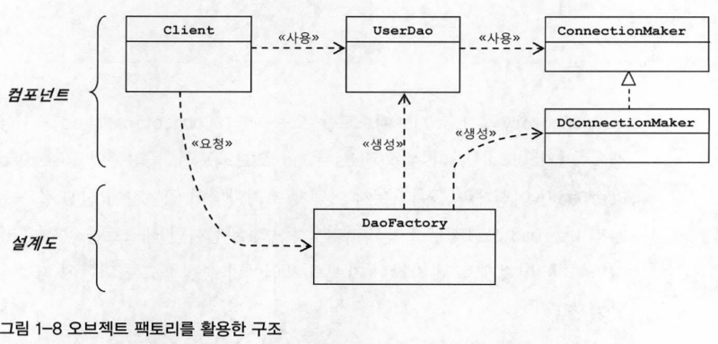

# 1장 오브젝트와 의존관계

## 1.4 제어의 역전 (IoC)

### 1.4.0 들어가기

- 제어의 역전 (IoC, Inversion of Control)
    - 프로그램의 제어 흐름 구조가 뒤바뀌는 것
    - 관심의 분리하고 책임을 나누고 유연하게, 확장 가능한 구조를 만들기 위해 팩토리를 도입하는 과정이 IoC를 적용하는 작업

### 1.4.1 오브젝트 팩토리

- **팩토리 (factory)**
    - 객체의 생성 방법을 결정하고, 그렇게 만들어진 오브젝트를 돌려주는 것, 이런 일을 하는 오브젝트
    - 오브젝트를 생성하는 쪽과 생성된 오브젝트를 사용하는 쪽의 역할과 책임을 깔끔하게 분리하려는 목적으로 사용
    - 디자인 패턴에서 말하는 특별한 문제를 해결하기 위해 사용되는 추상 팩토리 패턴이나 팩토리 메소드 패턴과는 다름

- 오브젝트 팩토리를 활용한 구조 설명
    - `UserDao`와 `ConnectionMaker`는 애플리케이션의 핵심적인 데이터 로직과 기술 로직을 담당 (실질적인 로직을 담당하는 컴포넌트)
    - `UserDao`는 변경이 필요 없으므로 안전하게 소스 코드를 보존할 수 있음, 동시에 DB연결 방식은 자유로운 확장 가능
    - `DaoFactory`는 애플리케이션의 오브젝트들을 구성하고 그 관계를 정의하는 책임을 가짐
        - 애플리케이션을 구성하는 컴포넌트의 구조와 관계를 정의한 설계도 같은 역할
        - 어떤 오브젝트가 어떤 오브젝트를 사용하는지 정의해놓은 코드
    - `DaoFactory` 분리 시, 애플리케이션의 컴포넌트 역할을 하는 오브젝트와 애플리케이션의 구조를 결정하는 오브젝트를 분리했다는 의미가 중요

### 1.4.2 오브젝트 팩토리의 활용

- DaoFactory에 UserDao가 아닌 다른 DAO 생성 기능을 넣으면, ConnectionMaker 구현 클래스의 오브젝트를 생성하는 코드가 메소드마다 반복
    - 중복 문제 해결 방법: 중복되는 내용을 메소드 분리

### 1.4.3 제어권의 이전을 통한 제어 관계 역전

- 일반적인 프로그램 흐름에서는 모든 오브젝트가 능동적으로 자신이 사용할 클래스를 결정, 언제 어떻게 그 오브젝트를 만들지를 스스로 관장, 모든 종류의 작업을 사용하는 쪽에서 제어하는 구조
- **제어의 역전에서는 오브젝트가 자신이 사용할 오브젝트를 스스로 선택하지도, 생성하지도 않음, 자신이 어떻게 만들어지고 어디에 사용되는지 알 수 없음**
    - 모든 제어 권한을 자신이 아닌 다른 대상에게 위임
    - 엔트리 포인트를 제외하면 모든 오브젝트는 위임받은 제어 권한을 갖는 특별한 오브젝트에 의해 결정됨
- 제어의 역전 예시
    - 서블릿
        - 서블릿에 대한 제어 권한을 가진 컨테이너가 적절한 시점에 서블릿 클래스의 오브젝트를 만들고 그 안에 메소드를 호출
        - 서블릿이나 JSP, EJB처럼 컨테이너 안에서 동작하는 구조는 간단한 방식이긴 하지만 제어의 역전 개념이 적용 되어 있음
    - 템플릿 메소드 패턴
        - 제어권을 상위 템플릿 메소드에 넘기고 자신은 필요할 때 호출되어 사용되도록 한다는 개념
        - 템플릿 메소드는 제어의 역전이라는 개념을 활용해 문제를 해결하는 디자인 패턴
    - 프레임워크 (Framework)
        - 애플리케이션 코드가 프레임워크에 의해 사용 → 애플리케이션 코드는 프레임워크가 짜 놓은 틀에서 수동적으로 동작
        - 프레임워크는 라이브러리의 일종 (Framework is a Library), IoC가 적용된 라이브러리
        - 프레임워크 위에 개발한 클래스를 등록시켜두고, 프레임워크가 흐름을 주도하는 중에 개발자가 만든 애플리케이션 코드를 사용하도록 만드는 방식
        - 분명한 제어의 역전 개념이 적용되어 있어야 함, 제어의 역전 개념이 적용된 대표적인 기술
        - **라이브러리 (Library)**
            - 라이브러리를 사용하는 애플리케이션 코드는 애플리케이션 흐름을 직접 제어
            - 동작하는 중에 필요한 기능이 있을 때, 능동적으로 라이브러리를 사용
- 제어의 역전에서는 프레임워크 또는 컨테이너와 같이 애플리케이션 컴포넌트의 생성과 관계 설정, 사용, 생명주기 관리 등을 관장하는 존재가 필요
- IoC를 적용함으로써 설계가 깔끔해지고 유연성이 증가하며 확장성이 좋아지기 때문에, 필요할 때 IoC 스타일의 설계와 코드를 만들어 사용 가능
- IoC를 애플리케이션 전반에 걸쳐 본격적으로 적용하려면 스프링과 같은 IoC 프레임워크의 도움을 받는 것이 훨씬 유리
- 스프링은 IoC를 모든 기능의 기초가 되는 기반 기술로 삼고 있으며, IoC를 극한까지 적용하고 있는 프레임워크