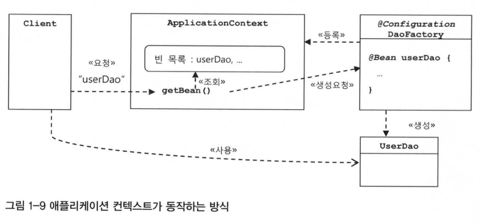

# 1장 오브젝트와 의존관계

## 1.5 스프링의 IoC

### 1.5.0 들어가기

- 스프링의 핵심 담당: 빈 팩토리 or 애플리케이션 컨텍스트
- 스프링 프레임워크 ⊇ 애플리케이션 컨텍스트 = IoC 컨테이너 = 스프링 (컨테이너) = 빈 팩토리 ⇔ 오브젝트 팩토리

### 1.5.1 오브젝트 팩토리를 이용한 스프링 IoC

- 빈 (bean)
    - **스프링이 직접 제어권을 가지고 직접 만들고 관계를 부여하는 오브젝트**
    - 자바 빈 or 엔터프라이즈 자바빈(EJB)에서 말하는 빈과 비슷한 오브젝트 단위의 애플리케이션 컴포넌트
    - 스프링 컨테이너가 생성과 관계 설정, 사용 등을 제어해주는 제어의 역전이 적용된 오브젝트 → 스프링이 IoC 방식으로 관리하는 오브젝트, 관리되는 오브젝트
    - 스프링을 사용하는 애플리케이션에서 만들어지는 모든 오브젝트가 다 빈은 아님
- 빈 팩토리 (bean factory)
    - **빈의 생성과 관계설정과 같은 제어를 담당하는 IoC 오브젝트**
    - 빈을 생성하고 관계를 설정하는 IoC의 기본 기능에 초점을 맞춤
    - 스프링의 IoC를 담당하는 핵심 컨테이너
    - 빈을 등록하고 생성하고, 조회하고, 돌려주고 그 외 부가적인 빈을 관리하는 기능을 담당
    - 빈 팩토리를 바로 사용하지 않고 이를 확장한 애플리케이션 컨텍스트를 이용
    - `BeanFactory`: 빈 팩토리가 구현하고 있는 가장 기본적인 인터페이스의 이름

### 1.5.2 애플리케이션 컨텍스트의 동작방식

- 애플리케이션 컨텍스트 (application Context)
    - **애플리케이션 전반에 걸쳐 모든 구성 요소의 제어 작업을 담당하는 IoC 엔진**
    - 빈 팩토리를 더 확장한 개념, IoC 방식을 따라 만들어진 일종의 빈 팩토리
    - 별도의 정보를 참고해서 빈(오브젝트)의 생성, 관계설정 등의 제어 작업을 총괄
    - 그 자체로는 애플리케이션 로직을 담당하지는 않지만, IoC방식을 이용해 애플리케이션 컴포넌트를 생성하고, 사용할 관계를 맺어주는 등의 책임을 담당
    - 스프링의 가장 대표적인 오프젝트, 애플리케이션에서 IoC를 적용해서 관리할 모든 오브젝트에 대한 생성과 관계 설정을 담당
    - 애플리케이션도 애플리케이션 컨텍스트와 그 설정 정보를 따라서 만들어지고 구성됨
    - `@Configuration`: 스프링이 빈 팩토리를 위한 오브젝트 설정을 담당하는 클래스라고 인식하도록 애노테이션 선언
    - `@Bean`: 오브젝트를 만들어주는 메소드에 IoC용 메소드라고 인식하도록 애노테이션 선언
        - `@bean`을 붙인 메소드를 가져올 때, 메소드의 이름이 빈의 이름이 됨
    - `ApplicationContext`: 애플리케이션 컨텍스트가 구현해야 하는 기본 인터페이스를 가리킴, `BeanFactory` 상속
        - 애플리케이션 컨텍스트는 `ApplicationContext` 타입의 오브젝트
        - `@Configuration`이 붙은 자바 코드를 설정 정보로 사용하려면 `AnntationConfigApplicationContext`를 이용
        - `getBean()` 메소드는 `ApplicationContext`가 관리하는 오브젝트를 요청하는 메소드
            - 기본적으로 Object 타입으로 리턴되어 오브젝트에 다시 캐스팅을 해주어야 함
            - 제네릭 메소드 방식을 사용해 `getBean()` 두번째 파라미터에 리턴 타입을 주면 캐스팅 코드 불필요
        - 직접 오브젝트를 생성하고 관계를 맺어주는 코드가 없고, 생성 정보와 연관 관계를 별도의 설정 정보를 통해 얻음
        - 클라이언트가 애플리케이션 컨텍스트의 `getBean()` 메소드를 호출하면 자신의 빈 목록에서 요청한 이름이 있는지 찾음
            - 존재하면 빈을 생성하는 메소드를 호출해서 오브젝트를 생성 시킨 후 클라이언트에게 돌려줌
        - IoC 원리를 그대로 적용하는데 애플리케이션 컨텍스트를 사용하는 이유
            - **범용적이고 유연한 방법으로 IoC 기능을 확장 가능**
        - 오브젝트 팩토리로 직접 사용했을 때와 애플리케이션 컨텍스트를 사용했을 때 비교해서 얻을 수 있는 장점
            - **클라이언트는 구체적인 팩토리 클래스를 알 필요 없음**
                - 애플리케이션 컨텍스트를 사용하면 오브젝트 팩토리가 아무리 많아져도 이를 알아야 하거나 직접 사용할 필요가 없음
                - 애플리케이션 컨텍스트를 이용하면 일관된 방식으로 원하는 오브젝트를 가져올 수 있음
                - 자바 코드를 작성하는 대신 XML처럼 단순한 방법을 사용해, 애플리케이션 컨텍스트가 사용할 IoC 설정 정보를 만들 수 있음
            - **애플리케이션 컨텍스트는 종합 IoC 서비스를 제공**
                - 애플리케이션 컨텍스트의 역할은 오브젝트가 만들어지는 방식, 시점과 전략을 다르게 가져갈 수 있음
                - 부가적으로 자동 생성, 오브젝트에 대한 후 처리, 정보의 조합, 설정 방식의 다변화, 인터셉팅 등 오브젝트를 효과적으로 활용할 수 있는 다양한 기능 제공
                - 빈이 사용할 수 있는 기반 기술 서비스나 외부 시스템과 연동 등을 컨테이너 차원에서 제공
            - **애플리케이션 컨텍스트는 빈을 검색하는 다양한 방법을 제공**
                - 애플리케이션 컨텍스트의 `getBean()` 메소드는 빈의 이름을 이용해 빈을 찾음
                - 타입만으로 빈을 검색하거나, 특별한 애노테이션 설정이 되어있는 빈을 찾을 수 있음

### 1.5.3 스프링 IoC의 용어 정리

- 스프링의 설정정보/설정 메타정보 (configuration metadata)
    - **애플리케이션 컨텍스트 또는 빈 팩토리가 IoC를 적용하기 위해 사용하는 메타정보**
    - 컨테이너에 어떤 기능을 세팅하거나 조정하는 경우에도 사용, IoC 컨테이너에 의해 관리되는 애플리케이션 오브젝트를 생성하고 구성할 때 사용
    - 애플리케이션의 형상 정보, 애플리케이션의 전체 그림이 그려진 청사진
- IoC 컨테이너 (IoC Container or Container)
    - **IoC 방식으로 빈을 관리하는 의미로 애플리케이션 컨텍스트나 빈 팩토리를 컨테이너 or IoC 컨테이너라고 함**
    - 애플리케이션 컨텍스트는 그 자체로 `ApplicationContext` 인터페이스를 구현한 오브젝트를 가리키기도 함
        - 애플리케이션 컨텍스트 오브젝트는 하나의 애플리케이션에서 여러 개가 만들어져 사용, 이를 통틀어 스프링 컨테이너라고 부름
- 스프링 프레임워크 (Spring Framework)
    - IoC 컨테이너, 애플리케이션 컨텍스트를 포함해서 스프링이 제공하는 모든 기능을 통틀어 말할 때 주로 사용