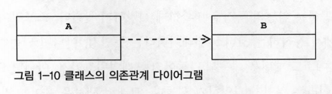
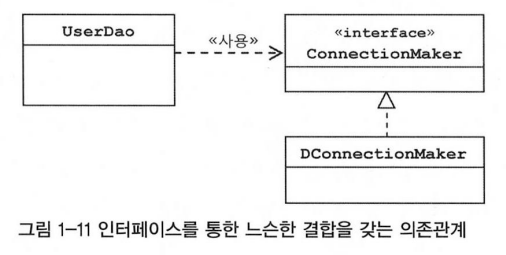
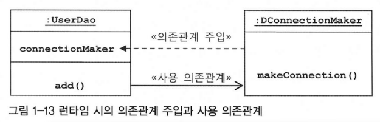

# 1장 오브젝트와 의존관계

## 1.7 의존관계 주입(DI) 

### 1.7.1 제어의 역전(IoC)과 의존관계 주입

- 객체를 생성하고 관계를 맺어주는 등의 작업을 담당하는 기능을 일반화한 것이 스프링의 IoC 컨테이너
- 의존관계 주입(Dependency Injection, DI)
    - **오브젝트 레퍼런스를 외부로부터 제공(주입)받고 이를 통해 여타 오브젝트와 다이나믹하게 의존관계가 만들어짐**
    - 스프링이 제공하는 IoC 방식, 좀 더 의도가 명확한 명칭, 스프링 IoC 기능의 대표적인 동작 원리 (IoC 컨테이너 = DI 컨테이너)
    
### 1.7.2 런타임 의존관계 설정 

- 의존 관계
    - 두 개의 클래스 또는 모듈이 의존관계에 있다고 말할 때는 항상 방향성을 부여
    - 누가 누구에게 의존하는 관계에 있다, 의존한다는 것은 의존대상이 변하면 그것이 영향을 미친다는 의미
    - 기능이 추가되거나 변경되거나, 형식이 바뀌거나 할 경우 영향이 전달
    - 사용에 대한 의존관계 예시
        - A에서 B에 정의된 메소드를 호출해서 사용하는 경우 (A → B)
        - B에 새로운 메소드가 추가되거나 기존 메소드의 형식이 바뀌면 A도 그에 따라 수정되거나 추가 필요
        - B의 형식은 그대로지만 기능ㅇ 내부적으로 변경되면, 결과적으로 A의 기능 수행 시 영향을 미침
        - A가 B에 의존하고 있지만, B는 A에 의존하지 않음, B는 A의 변화에 영향을 받지 않음
    - 의존관계는 방향성이 있음

- 인터페이스에 대해서만 의존관계를 만들어두면 인터페이스 구현 클래스와의 관계는 느슨해지면서 변화에 영향을 덜 받는 상태가 됨 → 결합도가 낮음
    - 인터페이스를 통해 의존관계를 제한해주면, 그만큼 변경에서 자유로워짐
    - `UserDao`는 `ConnectionMaker`에만 의존, `ConnectionMaker` 인터페이스가 변경 시, 그 영향을 `UserDao`가 직접 받음
    - `ConnectionMaker` 인터페이스를 구현한 `DConnectionMaker`가 다른 것으로 바뀌거나 내부에서 사용하는 메소드의 변화가 생겨도 `UserDao`에는 영향향을 주지 않음
    - `UserDao`는 `DConnectionMaker`라는 클래스의 존재도 알지 못함
    - UML에서 말하는 의존관계는 설계 모델의 관점에서 이야기 함
    - 런타임 시에 오브젝트 사이에 만들어지는 의존관계
        - 런타임 의존관계 or 오브젝트 의존관계: 설계 시점의 의존관계가 실체화된 것, 모델링 시점의 의존관계와는 성격이 다름
    - 의존 오브젝트(dependent object): 프로그램이 시작되고 `UserDao` 오브젝트가 만들어지고 나서 런타임 시에 의존관계를 맺는 대상, 실제 사용대상인 오브젝트

- 의존관계 주입
    - **구체적인 의존 오브젝트와 그것을 사용할 주체, 클라이언트라고 부르는 오브젝트를 런타임 시에 연결해주는 작업**
    - 의존관계 주입은 3가지 조건을 충족하는 작업
        - 클래스 모델이나 코드에는 런타임 시점의 의존관계가 드러나지 않음 → 인터페이스에만 의존하고 있어야 함
        - 런타임 시점의 의존관계는 컨테이너나 팩토리 같은 제 3의 존재가 결정
            - 제3의 존재: 관계 설정의 책임을 가진 코드를 분리해서 만들어진 오브젝트, 외부에서 오브젝트 사이의 런타임 관계를 맺어주는 책임을 지님
                - ex) DaoFactory, 스프링의 애플리케이션 컨텍스트, 빈 팩토리, IoC 컨테이너 등
        - 의존관계는 사용할 오브젝트에 대한 레퍼런스를 외부에서 제공(주입)해줌으로써 만들어짐
    - DI 컨테이너는 `UserDao`를 만드는 시점에서 생성자의 파라미터로 이미 만들어진 `DConnectionMaker`의 오브젝트 레퍼런스 전달
    - **주입**은 외부에서 내부로 무언가를 넘겨준다는 의미
        - 자바에서 오브젝트에 무엇인가 넣어주는 개념은 메소드를 실행하면서 파라미터로 오브젝트의 레퍼런스를 전달해주는 방법 뿐
            - 가장 손쉽게 사용할 수 있는 파라미터 전달이 가능한 메소드는 생성자
    - DI 컨테이너는 자신이 결정한 의존관계를 맺어줄 클래스의 오브젝트를 만들고 이 생성자의 파라미터로 오브젝트의 레퍼런스를 전달
    - DI 컨테이너에 의해 런타임 시에 의존 오브젝트를 사용할 수 있도록 그 레퍼런트를 전달받는 과정
        - 마치 **메소드(생성자)를 통해 DI 컨테이너가 UserDao에게 주입해주는 것과 같다고해서 의존관계 주입**이라고 부름
    - 자신이 사용할 오브젝트에 대한 선택과 생성의 제어권을 외부에 넘기고 자신은 수동적으로 주입받는 오브젝트를 사용한다는 점에서 IoC의 개넘에 잘 맞음
    - 스프링 컨테이너의 IoC는 주로 의존관계 주입 (DI)에 초점이 맞춰 있음, 스프링을 IoC 컨테이너, DI 컨테이너, DI 프레임워크라고도 부름

### 1.7.3 의존관계 검색과 주입

- 스프링이 제공하는 IoC 방법에는 의존관계 주입만 존재하지 않음
- 의존관계 검색(Dependency Lookup, DL)
    - **의존관계를 맺는 방법이 외부로부터 주입이 아니라 스스로 검색을 이용**
    - 자신이 필요로하는 의존 오브젝트를 능동적으로 찾음, 자신이 어떤 클래스의 오브젝트를 이용할지 결정하지 않음
    - 런타임 시 의존관계를 맺을 오브젝트를 결정하는 것과 오브젝트의 생성 작업은 외부 컨테이너에게 IoC로 맡김
        - 가져올 때는 메소드나 생성자를 통한 주입 대신 스스로 컨테이너에게 요청하는 방법을 사용
        - 적용 방법은 외부로부터 주입이 아니라 스스로 IoC 컨테이너에게 요청
        - 스프링 애플리케이션 컨텍스트라면 미리 정해놓은 이름을 전달해서 그 이름에 해당하는 오브젝트를 찾게 됨, 일종의 검색
            - 그 대상이 런타임 의존관계를 가질 오브젝트이므로 의존관계 검색이라고 부름
        - 스프링 애플리케이션 컨텍스트의 `getBean()` 메소드를 통해 의존관계 검색에 사용
- 의존관계 검색과 의존관계 주입 중 더 나은 방법 → 의존관계 주입이 훨씬 단순하고 깔끔함
    - 의존관계 검색 방법은 코드 안에 오브젝트 팩토리 클래스나 스프링 API가 나타남
    - 애플리케이션 컴포넌트가 컨테이너와 같이 성격이 다른 오브젝트에 의존하게 됨으로 바람직하지 않음
    - 의존관계 검색 방식을 사용해야 할 경우
        - 테스트 코드에서 애플리케이션 기동 시점에서 한번은 의존관계 검색 방식을 사용해 오브젝트를 가져와야 함
            - main() 에서 DI를 이용해 오브젝트를 주입받을 방법이 없기 때문
            - 서블릿은 스프링이 미리 만들어서 제공하기 떄문에 직접 구현할 필요는 없음
- 의존관계 검색과 의존관계 주입 적용 방법의 차이점
    - 의존관계 검색 방식에서 검색하는 오브젝트는 스프링의 빈일 필요가 없음
    - 의존관계 주입 방식에서 DI를 원하는 오브젝트는 먼저 자기 자신이 컨테이너가 관리하는 빈이 되어야 함
- DI에서 말하는 주입은 다이나믹하게 구현 클래스를 결정해서 제공받을 수 있도록 인터페이스 타입의 파라미터를 통해 이뤄져야 함
    - **DI 받는다**: 단순한 오브젝트 주입이 아니라, DI 개념을 따르는 주입임을 강조

### 1.7.4 의존관계 주입의 응용

- DI 기술의 장점
    - 모든 객체지향 설계와 프로그래밍 원칙을 따랐을 때 얻을 수 있는 장점이 그대로 DI 기술에도 적용
    - 코드에는 런타임 클래스에 대한 의존관계가 나타나지 않음
    - 인터페이스를 통해 결합도가 낮은 코드를 만듦 (낮은 결합도)
    - 관심사의 분리를 통해 얻어지는 높은 응집도
    - 다른 책임을 가진 사용 의존관계에 있는 대상이 바뀌거나 변경되더라도 자신은 영향을 받지 않음
    - 변경을 통한 다양한 확장 방법에 자유로움
- DI를 이용 시, 새로운 기능을 호출 과정에 추가하려고 한다면 앞 뒤의 코드를 같이 수정할 필요는 없음
    - 컨테이너가 사용하는 설정정보만 수정해서 런타임 의존관계만 새롭게 정의
- DI를 활용하는 방법은 매우 다양, 스프링이 제공하는 대부분의 기능은 DI 없이는 존재할 수 없음
- 스프링은 DI를 편하게 사용할 수 있도록 도와주는 도구이면서 그 자체로 DI를 적극 활용한 프레임워크

### 1.7.5 메소드를 이용한 의존관계 주입

- 의존관계 주입이 반드시 생성자를 사용해야 하는 것은 아님
- 생성자가 아닌 일반 메소드를 사용할 수 있을 뿐만 아니라, 생성자를 사용하는 방법보다 더 자주 사용
- 일반 메소드를 이용해 의존 오브젝트와의 관계를 주입하는 방법
    - **수정자 메소드를 이용한 방법**
        - 수정자(setter) 메소드는 외부에서 오브젝트 내부의 에트리뷰트 값을 변경하ㄴ려는 용도로 주로 사용
        - 항상 set으로 메소드가 시작, 수장자라고도 불림
        - 핵심 기능은 파라미터로 전달된 값을 보통 내부의 인스턴스 변수에 저장
        - 부가적으로 입력 값에 대한 검증이나 그 밖의 작업을 수행 가능
        - 외부로부터 제공받은 오브젝트 레퍼런스를 저장해뒀다가 내부의 메소드에서 사용하게 하는 DI 방식에서 활용 가능
    - **일반 메소드를 이용한 방법**
        - 여러 개의 파라미터를 갖는 일반 메소드를 DI용으로 사용
        - 생성자 메소드보다 나은 점: 한 번에 여러 개의 파라미터를 받을 수 있음 → 비슷한 타입이 여러 개면 실수하기 쉬움
        - 적절한 개수의 파라미터를 가진 여러 개의 초기화 메소드를 만들 수 있음 → 한번에 모든 필요한 파라미터를 받는 생성자보다 나음
- 스프링은 전통적으로 메소드를 이용한 DI 방법 중에서 수정자 메소드를 가장 많이 사용
- 수정자 메소드 DI를 사용 시, 메소드의 이름을 잘 짓는 것이 중요 → 메소드를 통해 DI를 받을 오브젝트의 타입 이름을 따르는 것이 무난