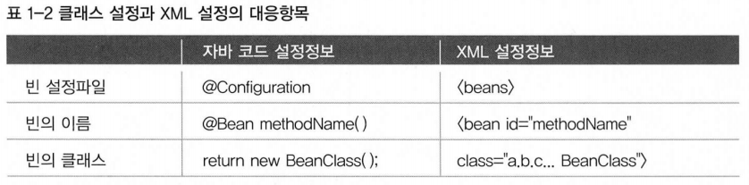
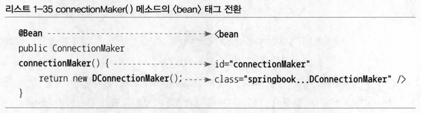
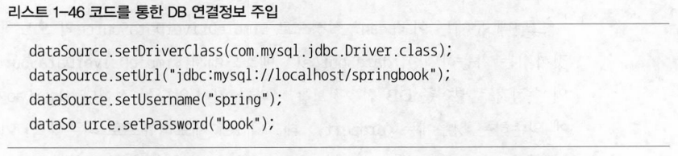
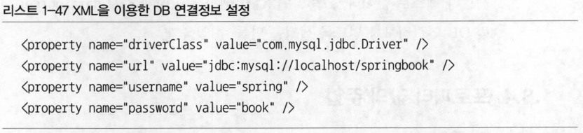

# 1장 오브젝트와 의존관계

## 1.8 XML을 이용한 설정

- 스프링은 `DaoFactory` 같은 자바 클래스를 이용하는 것 외에도 다양한 방법을 통해 DI 의존관계 설정정보를 만들 수 있음, 대표적으로 XML
    - XML은 단순한 텍스트 파일이기 때문에 다루기 쉬움, 쉽게 이해할수 있으며 컴파일과 같은 별도의 빌드 작업이 없다는 것도 장점
    - 환경이 달라져서 오브젝트의 관계가 바뀌는 경우에도 빠르게 변경사항을 반영 가능
    - 스키마나 DTD를 이용해 정해진 포맷을 따라 작성되었는지 손쉽게 확인 가능

### 1.8.1 XML 설정

- 스프링의 애플리케이션 컨텍스트는 XML에 담긴 DI 정보를 활용 가능
- DI 정보가 담긴 XML 파일은 `<beans>`를 루트 엘리먼트로 사용, `<beans>` 안에 여러 개의 `<bean>`을 정의 가능
- XML 설정은 `@Configuration`과 `@Bean`이 붙은 자바 클래스로 만든 설정과 내용이 동일

- 하나의 `@Bean` 메소드를 통해 얻을 수 있는 빈의 DI 정보
    - 빈의 이름: `@Bean` 메소드 이름이 빈의 이름, getBean()에서 사용
    - 빈의 클래스: 빈 오브젝트를 어떤 클래스를 이용해서 만들지를 정의
    - 빈의 의존 오브젝트
        - 빈의 생성자나 수정자 메소드를 통해 의존 오브젝트를 넣어줌
        - 의존 오브젝트도 하나의 빈이므로 이름이 있고, 이름에 해당하는 메소드를 호출해서 의존 오브젝트를 가져옴
        - 의존 오브젝트는 하나 이상일 수 있음
- XML에서 `<bean>`을 사용해도 위 세가지의 정보를 정의 가능
    -  의존하고 있는 오브젝트가 없는 경우에는 의존 오브젝트 정보는 생략 가능

<p align="center">
  
   태그 전환" style="margin-right: 1%;">
   태그 전환">
</p>

- `<bean>` 태그의 class 애트리뷰트에 지정하는 것은 자바 메소드에서 오브젝트를 만들 때 사용하는 클래스 이름, 패키지까지 모두 포함해야 함
- 메소드의 리턴 타입을 class 애트리뷰트에 사용하지 않도록 주의, XML에서는 리턴하는 타입을 지정하지 않아도 됨
- 자바빈 관례를 따라서 수정자 메소드는 프로퍼티가 됨, 프로퍼티 이름은 메소드 이름에서 set을 제외한 나머지 부분을 사용
- `<property>` 태그
    - name 애트리뷰트는 DI에 사용할 수정자 메소드의 프로퍼티 이름
    - ref 애트리뷰트는 주입할 오브젝트를 정의한 빈의 ID, 보통 프로퍼티의 이름과 DI 되는 빈의 이름이 같은 경우가 많음
    - 프로퍼티 이름은 주입할 빈 오브젝트의 인터페이스를 따르는 경우가 많음, 빈 이름도 인터페이스 이름을 사용하는 경우가 많음
        - 바뀔수 있는 클래스 이름보다는 대표적인 인터페이스 이름을 따르는 편이 좋음 → 다르게 정해도 상관은 없음
        - 빈의 이름을 바꾸는 경우, 그 이름을 참조하는 다른 빈의 `<property>` ref 애트리뷰트의 값도 함께 변경해야 함
        - 개발팀 내에서 공통적으로 따를 수 있는 명명 규칙이 있는 것이 좋음
- 때로는 같은 인터페이스를 구현한 의존 오브젝트를 여러 개 정의해두고 그 중에 원하는 걸 골라 DI하는 경우
    - 각 빈의 이름을 독립적으로 만들어두고 ref 애트리뷰트를 이용해 DI 받을 빈을 지정
- XML 문서는 미리 정해진 구조를 따라서 작성됐는지 검사 가능
    - XML 문서 구조를 정의하는 방법: DTD, Schema (스프링은 모두 지원)
    - DTD를 사용할 경우, `<bean>` 엘리먼트 앞에 다음과 같은 DTD 선언
        ```xml
        <!DOCTYPE beans PUBLIC "-//SPRING//DTD BEAN 2.0//EN" "http://www.springframework.org/dtd/spring-beans-2.0.dtd">
        ```
    - 스프링은 DI를 위한 기본 태그인 `<beans>, <bean>` 외에도 특별한 목적을 위해 별도의 태그를 사용할 수 있는 방법을 제공
    - 태그 사용 시, DTD 대신 네임스페이스가 지원되는 Schema를 사용해야 함
    - Schema를 사용할 경우, `<beans>` 태그를 기본 네임스페이스로 하는 Schema 선언
        ```xml
        <beans xmlns="http://www.springframework.org/schema/beans"
       xmlns:xsi="http://www.w3.org/2001/XMLSchema-instance"
       xsi:schemaLocation="http://www.springframework.org/schema/beans http://www.springframework.org/schema/beans/spring-beans.xsd">
        ```
    - 특별한 이유가 없으면 DTD보다는 Schema를 사용하는 편이 바람직함

### 1.8.2 XML을 이용하는 애플리케이션 컨텍스트

- XML에서 빈의 의존관계 정보를 이용하는 IoC/DI 작업에는 `GenericXmlApplicationContext`를 사용
    - 생성자 파라미터로 XML 파일의 클래스패스를 지정
    - XML 설정파일은 클래스패스 최상단에 두면 편함 
    - 애플리케이션 컨텍스트가 사용하는 XML 설정파일의 이름은 관례를 따라 `applicationContext.xml` 이라고 만듦
    - 클래스패스를 시작하는 /는 넣을 수도 있고 생략할 수 도 있음, 시작하는 /가 없는 경우에도 항상 루트에서부터 시작
- `ClassPathXmlApplicationContext`는 XML 파일을 클래스패스에서 가져올 때 사용할 수 있는 편리하는 기능이 추가
    - 클래스패스의 경로정보를 클래스에서 가져오는 것도 가능
        ```java
        new GenericXmlApplicationContext("springbook/user/dao/daoContext.xml");
        new ClassPathXmlApplicationContext("daoContext.xml", UserDao.class);
        ```

### 1.8.3 DataSource 인터페이스로 변환

- `Datasource`는 `getConnection()`이라는 DB 커넥션을 가져오는 기능 외에도 여러 개의 메소드를 갖고 있어 인터페이스를 직접 구현하기는 부담스러움
- `Datasource`의 `getConnection()`은 `SQLException`만 던지기 떄문에, 메소드의 throws에 선언했던 `ClassNotFoundException` 제거 가능
- `SimpleDriverDataSource` 는 DB 연결에 필요한 필수 정보를 제공받을 수 있도록 여러 개의 수정자 메소드를 가짐
    - ex) JDBC 드라이버 클래스, JDBC URL, 아이디, 비밀번호
    - DB 연결정보를 수정자 메소드를 통해 넣어줌 → 오브젝트 레벨에서 DB 연결 방식을 변경 가능
        ```java
        @Bean
        public DataSource dataSource() {
            SimpleDriverDataSource dataSource = new SimpleDriverDataSource();

            dataSource.setDriverClass(com.mysql.jdbc.Driver.class);
            dataSource.setUrl("jdbc:mysql://52.79.118.61:3306/cmsdb");
            dataSource.setUsername("dwmaster");
            dataSource.setPassword("aws190131!");

            return dataSource;
        }
        ```

### 1.8.4 프로퍼티 값의 주입

- 수정자 메소드는 다른 빈이나 오브젝트뿐 아니라 스트링 같은 단순 값을 넣어줄 수도 있음
    - 다른 빈 오브젝트의 레퍼런스가 아닌 단순 정보도 오브젝트를 초기화하는 과정에서 수정자 메소드에 넣을 수 있음
    - DI에서처럼 오브젝트의 구현 클래스를 다이나믹하게 바꿀 수 있게 해주는 것이 목적이 아님
    - 클래스 외부에서 DB연결정보와 같이 변경 가능한 정보를 설정해줄 수 있도록 만들기 위한 목적
    - 텍스트나 단순 오브젝트 등을 수정자 메소드에 넣어주는 것을 스프링에서는 '값을 주입한다'고 말함 → 성격은 다르지만 일종의 DI라고 볼 수 있음
- 스프링의 빈으로 등록될 클래스에 수정자 메소드가 정의되어 있다면 `<property>`를 사용해 주입할 정보를 지정할 수 있다는 점에서 `<property ref="">`와 동일
    - 다른 빈 오브젝트의 레퍼런스(ref)가 아니라 단순 값(value)을 주입해주는 것이기 때문에 ref 애트리뷰트 대신 value 애트리뷰트를 사용

<p align="center">
  
   태그 전환" style="margin-right: 1%;">
</p>

- 스프링이 프로퍼티의 값을 수정자 메소드의 파라미터 타입을 참고해서 적절한 형태로 변환
    - 스프링은 value에 지정한 텍스트 값을 적절한 자바 타입을 변환
    ```java
    Class driverClass = Class.forName("com.mysql.jdbc.Driver");
    dataSource.setDriverClass(driverClass);
    ```

### 1.9 정리
- 관심사의 분리(리팩토링): 책임이 다른 코드를 분리해서 두 개의 클래스로 생성
- 전략 패턴: 바꿀 수 있는 쪽의 클래스는 인터페이스를 구현하도록 하고, 다른 클래스에서 인터페이스를 통해서만 접근하도록 만듦
    - 인터페이스를 정의한 쪽의 구현 방 법이 달라져 클래스가 바뀌더라도, 그 기능을 사용하는 클래스의 코드는 같이 수정할 필요가 없도록 변경
- 개방 패쇄 원칙: 자신의 책임 자체가 변경되는 경우 외에는 불필요한 변화가 발생하지 않도록 막아줌
    - 자신이 사용하는 외부 오브젝트의 기능은 자유롭게 확장하거나 변경할 수 있게 만듦
- 낮은 결합도, 높은 응집도: 한쪽의 기능 변화가 다른 쪽의 변경을 요구하지 않아도 되게 했고, 자신의 책임과 관심사에만 순수하게 집중
    - 이를 통해 깔끔한 코드를 만들 수 있었음
- 제어의 역전(IoC): 오브젝트가 생성되고 여타 오브젝트와 관계를 맺는 작업의 제어권을 별도의 오브젝트 팩토리를 만들어 넘김
    - 또는 오브젝트 팩토리의 기능을 일반화한 IoC 컨테이너로 넘겨서 오브젝트가 자신이 사용할 대상의 생성이나 선택에 관한 책임으로부터 자유롭게 만듦
- 싱글톤 레지스트리: 전통적인 싱글톤 패턴 구현 방식의 단점을 살펴보며, 서버에서 사용되는 서비스 오브젝트로서의 장점을 살릴 수 있는 싱글톤을 사용하면서도 싱글톤 패턴의 단점을 극복할 수 있도록 설계된 컨테이너를 활용하는 방법 확인
- 의존관계 주입(DI): 설계 시점과 코드에는 클래스와 인터페이스 사이의 느슨한 의존관계만 만들어놓고
    - 런타임 시에 실제 사용할 구체적인 의존 오브젝트를 제3자(DI 컨테이너)의 도움으로 주입받아서 다이나믹한 의존관계를 갖게 해주는 IoC의 특별한 케이스 확인
- 생성자 주입과 수정자 주입: 의존 오브젝트를 주입할 때 생성자를 이용하는 방법과 수정자 메소드를 이용하는 방법 확인
- XML 설정: XML을 이용해 DI 설정정보를 만드는 방법과 의존 오브젝트가 아닌 일반 값 을 외부에서 설정해서 런타임 시에 주입하는 방법 확인
- **스프링은 어떻게 오브젝트가 설계되고 만들어지고, 어떻게 관계를 맺고 사용되는지에 관심을 갖는 프레임워크**
- **스프링의 관심은 오브젝트와 그 관계 뿐**
    - **오브젝트를 어떻게 설계하고, 분리하고, 개선하고, 어떤 의존관계를 가질지 결정하는 일 → 스프링이 아니라 개발자의 역할이며 책임**
- **스프링은 원칙을 잘 따르는 설계를 적용하려고 할 때, 필연적으로 등장하는 번거로운 작업을 편하게 할 수 있도록 도와주는 도구일 뿐**
- 스프링을 사용한다고 좋은 객체지향 설계와 깔끔하고 유연한 코드가 저절로 만들어지지 않음
    - 객체지향 설계와 프로그래밍에 대한 학습과 훈련, 경험이 필요함 → 각자 공부해야할 책임이 있는 과제
    - 좋은 설계와 코드를 적용하고자 할 때 좋은 동반자 역할