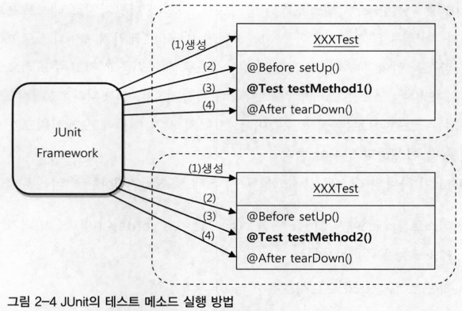

# 2장 테스트

## 2.3 개발자를 위한 테스팅 프레임워크 JUnit

- 테스트 없이는 스프링도 의미 없음, 스프링 프레임워크 자체도 JUnit 프레임워크를 이용해 테스틀 만들어가며 개발
- JUnit 테스트는 `main()` 메소드와 `System.out.println()`으로 만든 테스트만큼 단순하기 때문에 빠르게 작성 가능
- 테스트 작성 시 자주 필요한 편리한 여러가지 부가 기능도 제공

### 2.3.1 JUnit 테스트 실핼 방법

- JUnit 테스트 실행 방법은 자바 IDE에 내장된 JUnit 테스트 지원 도구를 사용하는 것
- JUnit은 한 번에 여러 테스트 클래스를 동시에 실행 가능
- 프로젝트의 빌드를 위해 빌드 툴과 스크립트를 사용하고 있다면, 빌드 툴에서 제공하는 JUnit 플러그인이나 태스크를 이용해 JUnit 테스트를 실행 할 수 있음
- 여러 개발자가 마든 코드를 모두 통합해서 테스트를 수행해야 할 경우, 서버에서 모든 코드를 가져와 통합하고 빌드한 뒤 테스트를 수행
    - 빌드 스크립트를 이용해 JUnit 테스트를 실행하고 그 결과를 메일 등으로 통보받는 방법을 사용하면 됨

### 2.3.2 테스트 결과의 일관성

- 반복적으로 테스트를 했을 때 테스트가 실패하기도 하고 성공하기도 한다면 좋은 테스트가 아님
- 코드에 변경사항이 없다면 테스트는 항상 동일한 결과를 내야 함
- 단위 테스트는 항상 일관성 있는 결과가 보장돼야 한다는 점을 잊어선 안됨
- DB에 남아있는 데이터와 같은 외부 환경에 영향을 받지 말아야 함
- 테스트를 실행하는 순서를 바꿔도 동일한 결과가 보장되도록 만들어야 함

### 2.3.3 포괄적인 테스트

- 테스트를 안만드는 것도 위험한 일이지만, 성의 없이 테스트를 만드는 바람에 문제가 있는 코드인데도 테스트가 성공하게 만드는 건 더 위험
    - 한가지 결과만 검증하고 마는 것은 상당히 위험
- 테스트 메소드는 한 번에 한 가지 검증 목적에만 충실하느 것이 좋음
- JUnit은 하나의 클래스 안에 여러 개의 테스트 메소드가 들어가는 것을 허용
    - `@Test`가 붙어 있고 `public` 접근자가 있으며 리턴 값이 `void`형이고 파라미터가 없다는 조건을 지키면 됨
- 자바빈 규약을 따르는 클레스에 생성자를 명시적으로 추가했을 때는 파라미터가 없는 디폴트 생성자도 함께 정의 필요
- 모든 테스트는 실행 순서와 상관ㅇ벗이 독립적으로 항상 동일한 결과를 낼 수 있도록 해야 함
- JUnit은 예외조건 테스트를 위한 특별한 방법을 제공
    - `@Test` 애노테이션의 expected 엘리먼트 사용
    - expected 테스트 실행 중에 발생하리라 기대하는 예외 클래스를 넣어주면 됨
- 종종 단순하고 간단한 테스트가 치명적인 실수를 피할 수 있게 해주기도 함
- 개발자가 테스트를 만들 때 하는 실수 중 하나, 성공하는 테스트만 골라서 만듦
    - 테스트를 작성할 때도 문제가 될 만한 상황이나, 입력 값 등은 잘 피해서 코드를 만드는 습성이 있음
    - 테스트 코드를 통한 자동 테스트 뿐 아니라, UI를 통한 수동 테스트를 할 때도 빈번하게 발생하는 문제
> "항상 네거티브 테스트르 먼저 만들라" - 로드 존슨
- 개발자는 빨리 테스트를 만들어 성공하는 것을 보고 다음 기능으로 나아가고 싶어하기 때문
    - 긍정적인 경우를 골라 성공할 만한 테스트를 먼저 작성하게 되기 쉬움
    - 테스트를 작성할 때 부정적인 케이스를 먼저 만드는 습관을 들이는 게 좋음
    - 확인할 수 있는 테스트를 먼저 만들려고 한다면 예외적인 상황을 빠뜨리지 않는 꼼꼼한 개발이 가능

### 2.3.4 테스트가 이끄는 개발

- 테스트 할 코드를 만든지 않고, 테스트 코드부터 만드는 방식
    - 이런 순서에 따라 개발을 진행하는 구체적인 개발 전략 
    - 추가하고 싶은 기능을 코드로 표현하려고 했기 때문에 가능
- 테스트에 만들고 싶은 기능에 대한 조건, 행위, 결과에 대한 내용이 표현
- 테스트 코드는 마치 잘 작성된 하나의 기능정의서처럼 보임
- 보통 기능설꼐, 구현 테스트라는 일반적인 개발 흐름의 기능설계에 해당하는 부분을 테스트 코드가 일부분 담당한다고 볼수 있음
- 테스트 코드는 코드로 된 설계 문서
    - 실제 기능을 가진 애플리케이션 코드를 만들고 나면, 테스트를 실행해서 설계한 대로 코드가 동작하는지를 빠르게 검증 가능
    - 만약 테스트가 실패하면 이때는 설계한 대로 코드가 만들어지지 않았음을 바로 알 수 있음
    - 문제가 되는 부분이 무엇인지에 대한 정보도 테스트 결과를 통해 얻을 수 있음
    - 다시 코드를 수정하고 테스트를 수행해서 테스트가 성공하도록 애플리케이션 코드를 계속 다듬음
    - 테스트가 성공하면, 그 순간 코드 구현과 테스트라는 두 가지 작업이 동시에 끝남
- 테스트 주도 개발(Test Driven Development, TDD)
    - **만들고자 하는 기능의 내용을 담고 있으면서 만들어진 코드를 검증도 해줄 수 있도록 테스트 코드를 먼저 만들고, 테스트를 성공하게 해주는 코드를 작성하는 방식의 개발 방법**
    - 테스트를 코드보다 먼저 작성한다고 해서 테스트 우선 개발(Test First Development)이라고도 함
    - 개발자가 테스트를 만들어가며 개발하는 방법이 주는 장점을 극대화한 방법
    - TDD의 기본 원칙: **실패한 테스트를 성공시키기 위한 목적이 아닌 코드는 만들지 않는다**
    - 기본 원칙을 따랐다면 만들언진 모든 코드는 빠짐없이 테스트로 검증된 것
    - 아예 테스트를 먼저 만들고 그 테스트가 성공하도록 하는 코드만 만드는 식으로 진행하기 때문에 테스트를 빼먹지 않고 꼼꼼하게 만들어낼 수 있음
    - 테스트를 작성하는 시간과 애플리케이션 코드를 작성하는 시간의 간격이 짧아짐
    - 코드를 만들고 테스트를 수행할 때까지 걸리는 시간은 0에 가까움
    - 테스트를 만들어뒀기 떄문에 코드를 작성하면 바로바로 테스트를 실행해볼 수 있음
    - 코드에 대한 피드백을 매우 빠르게 받을 수 있게 됨
    - 매번 테스트가 성공하는 것을 보면서 작성한 코드에 대한 확신을 가질 수 있어, 가벼운 바음으로 다음 단계로 넘어갈 수 있음
    - 자신감과, 마음의 여유를 주는 방법
    - 테스트를 작성하고 이를 성공시키는 코드를 만드는 작업의 주기를 가능한 짧게 가져가도록 권장
        - 테스트를 반나절 동안 만들고 오후 내내 테스트를 통과시키는 코드를 만드는 식의 개발은 그다지 좋은 방법이 아님
    - TDD를 하면서 자연스럽게 단위 테스트를 만들 수 있음
    - 빠르게 자동으로 실행할 수 있는 단위 테스트가 아니고서는 이런 식의 개발이 거의 불가능
    - 테스트할 때마다 서버를 띄우고 재배치하는 시간이 필요하다면 테스트를 자주하기 귀찮고 테스트는 점점 뒤로 미뤄짐
    - 머리속으로 진행되는 테스트는 제약이 심하고, 오류가 많고, 나중에 다시 반복하기 힘듦
        - 머리속에서 복잡하게 진행하던 작업을 실제 코드로 끄집어 내놓으면, TDD가 됨
    - TDD는 처음에는 이상하게 보일지 모르겠지만 사실은 매우 자연스러우며, 한번 익숙해지고 나면 TDD가 아니고는 개발을 못하겠다고 할지도 모를만큼 매력적인 방법
    - TDD의 장점 중 하나: **코드를 만들어 테스트를 실행하는 그 사이의 간경이 매우 짧다는 점**
    - 개발한 코드의 오류는 빨리 발견할수록 좋음
    - 빨리 발견된 오류는 쉽게 대응이 가능하기 때문, 테스트 없이 오랜 시간 동안 코드를 만들고 나서 테스트를 하면 오류가 발생했을 때 원인을 찾기가 쉽지 않음
    - 간단한 테스트를 해봤으면 미리미리 쉽게 발견할 수 있었던 사소한 문제도, 나중에 많은 코드와 얽혀서 돌아가는 상황에는 쉽게 찾지 못하는 경우가 많음
    - 테스트는 코드를 작성한 후에 가능한 빨리 실행할 수 있어야 함
        - 테스트 없이 한 번에 너무 많은 코드를 만드는 것은 좋지 않음
        - 테스트를 먼저 만들어두면 코딩이 끝나자마자 바로 테스트를 실행할 수 있으니 가장 좋은 방법
        - 이런 방법이 불편하면, 일정 분량의 코딩을 먼저 해놓고 빠른 시간 안에 테스트 코드를 만들어 테스트해도 상관 없음
    - 테스트르 만들고 자주 실행하면 개발이 지연되지 않을까 염려 가능 → 사실은 그렇지 않음
        - 테스트는 애플리케이션 코드보다 상대적으로 작성하기 쉬움
        - 테스트가 독립적이기 떄문에, 코드의 양에 비해 작성하는 시간은 얼마 걸리지 않음
        - 테스트 덕분에 오류를 빨리 잡아낼 수 있어서 전체적인 개발 속도는 오히려 빨라짐
        - 통합 테스트의 비효율성을 생각해보면 미리미리 단위 테스트를 만들어서 코드 검증해두는 편이 좋음
- 스프링은 테스트하기 편리한 구조의 애플리케이션을 만들게 도와줌
    - 엔터프라이즈 애플리케이션 테스트를 빠르고 쉽게 작성할 수 있는 매우 편리한 기능을 많이 제공

### 2.3.5 테스트 코드 개선

- 애플리케이션 코드만 리팩토링의 대상이 아님
    - 필요하다면 테스트 코드도 언제든지 내부구조와 설계를 개선해서 더 깔끔하고 이해하기 쉬우면 변경이 용이한 코드로 만들 필요가 있음
    - 테스트 코드 자체가 이미 자신에 대한 테스트이기 때문에 테스트 결과가 일정하게 유지된다면 얼마든지 리페토링 가능
- JUnit 프레임워크는 테스트 메소드를 실행할 때 부가적으로 해주는 작업이 몇 가지 존재
- `@Before`
    - **테스트를 실행할 때마다 반복되는 준비 작업을 별도의 메소드에 넣게 해주고, 매번 테스트 코드를 실행하기 전에 먼저 실행 기능**
    - JUnit이 제공하는 애노테이션, `@Test` 메소드가 실행되기 전에 먼저 실행돼야 하는 메소드를 정의
- 프레임 워크는 스스로 제어권을 가지고 주도적으로 동작, 개발자가 만든 코드는 프레임워크에 의해 수동적으로 실행
- JUnit 프레임워크가 하나의 테스트 클래스를 가져와 테스트를 수행하는 방식
    1. 테스트 클래스에서 `@Test`가 붙은 `public`이고 `void`형이며 파라미터가 없는 테스트 메소드를 모두 찾음
    2. 테스트 클래스의 오브젝트를 하나 생성
    3. `@Before`가 붙은 메소드가 있으면 실행
    4. `@Test`가 붙은 메소드를 하나 호출하고 테스트 결과를 저장
    5. `@After`가 붙은 메소드가 있으면 실행
    6. 나머지 테스트 메소드에 대해 2~5번 반복
    7. 모든 테스트의 결과를 종합해서 돌려줌
- JUnit은 `@Test`가 붙은 메소드를 실행하기 전과 후에 각각 `@Before`와 `@After`가 붙은 메소드를 자동으로 실행
    - 보통 하나의 테스트 클래스 안에 있는 테스트 메소드들은 공통적인 준비 작업과 정리 작업이 필요한 경우가 많음
    - JUnit이 자동으로 메소드를 실행하여 매우 편리, 각 테스트 메소드에서 직접 메소드를 호출할 필요도 없음
    - 테스트 메소드에서 직접 호출하지 않기 떄문에 서로 주고받을 정보나 오브젝트가 있으면 인스턴스 변수를 이용해야 함
- 각 테스트 메소드를 실행할 때마다 테스트 클래스의 오브젝트를 새로 만듦
    - 한번 만들어진 테스트 클래스의 오브젝트는 하나의 테스트 메소드를 사용하고 나면 버려짐
    - 테스트 클래스가 @Test 테스트 메소드를 두개 갖고 있으면, 테스트가 실행되는 중에 JUnit은 해당 클래스의 오브젝트를 두 번 만듦

- 테스트 메소드를 실행할 때마다 새로운 오브젝트를 만드는 이유
    - JUnit 개발자는 각 테스트가 서로 영향을 주지 않고 독립적으로 실행됨을 확실히 보장해주기 위해 매번 새로운 오브젝트를 만듦
    - 인스턴스 변수도 부담없이 사용 가능 → 다음 테스트 메소드가 실행될 때는 새로운 오브젝트가 만들어져 초기화 됨
- 테스트 메소드의 일부에서만 공통적으로 사용되는 코드가 존재 시
    - `@Before`을 사용하는 것보단, 일반적인 메소드 추출 방법을 사용해여 메소드를 분리하고 테스트 메소드에서 직접 호출해 사용하는 편이 나음
    - 공통적인 특징을 지닌 테스트 메소드를 모아서 별도의 테스트 클래스를 만드는 방법도 가능
- 픽스처(fixture)
    - **테스트를 수행하는 데 필요한 정보나 오브젝트**
    - 일반적으로 픽스처는 여러 테스트에서 반복적으로 사용되기 때문에 `@Before` 메소드를 이용해 생성해두면 편리
    - 매번 새로운 테스트 오브젝가 생성되므로 인스턴스 변수에서 바로 초기화 해도 상관 없음
    - 픽스처 생성 로직이 흩어져 있는 것보다는 모여 있는 편이 좋으므로 `@Before` 메소드를 이용