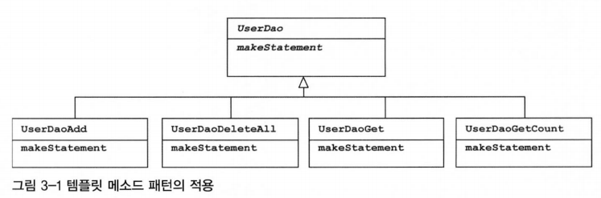
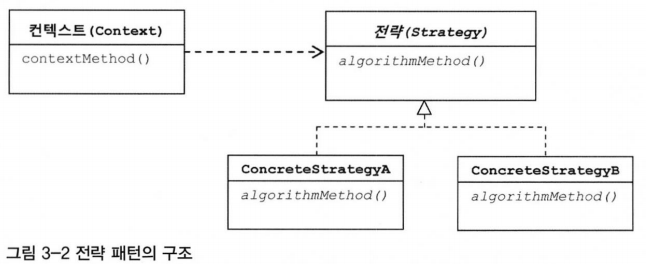
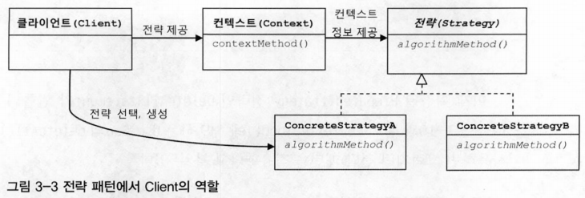

# 3장 템플릿

## 3.2 변하는 것과 변하지 않는 것

### 3.2.1 JDBC `try/catch/finally` 코드의 문제점

- 복잡한 `try/catch/finally` 블록이 이중으로 중첩되어 나오는데, 모든 메소드마다 반복됨
    - 언제 터질지도 모르는 폭탄과 같은 코드가 됨
- 테스트를 통해 DAO마다 예외상황에서 리소스 반납 체크는 적용하기 쉽지 않음
    - 예외 상황을 처리하는 코드는 테스트하기 매우 어려우며, 모든 메소드에 대해 이런 테스트를 일일이 하는 건 번거로움
- 이런 코드를 효과적으로 다룰 수 있는 방법 → 중복되는 코드와 로직에 따라 확장되고 자주 변하는 코드를 분리해내는 작업

### 3.2.2 분리와 재사용을 위한 디자인 패턴 적용

- 변하는 부분을 메소드로 추출
    - 변하지 않는 부분이 변하는 부분을 감싸고 있어서 변하지 않는 부분을 추출하기 어려워 보여 반대로 추출 진행
    - 분리시키고 남은 메소드가 재사용이 필요한 부분이고, 분리된 메소드는 DAO로직마다 새롭게 만들어서 확장돼야 하는 부분
    - 이득이 없어보임
- 템플릿 패턴을 이용하여 분리
    - 템플릿 메소드 패턴: 상속을 통해 기능을 확장해서 사용
    - 변하지 않는 부분은 슈퍼클래스에 두고, 변하는 부분은 추상 메소드로 정의하여, 서브 클래스에서 오버라이드하여 새롭게 정의
    - 템플릿 메소드 패턴으로의 접근은 제한이 많음
        - DAO 로직마다 상속을 통해 새로운 클래스를 만들어야 함
        - 확장구조가 이미 클래스를 설계하는 시점에서 고정
- 전략 패턴을 이용하여 분리
    - 개방 폐쇄 원칙을 잘 지키는 구조이면서도, 템플릿 메소드 패턴보다 유연하고 확장성이 뛰어남
    - 오브젝트를 아예 둘로 분리하고 클래스 레벨에서는 인터페이스를 통해서만 의존하도록 만드는 전략 패턴
    - OCP 관점에서 보면 확장에 해당하는 변하는 부분을 별도의 클래스로 만들어 추상화된 인터페이스를 통해 위임하는 방식
    - context의 contextMethod()에서 일정한 구조를 가지고 동작하다가 특정 확장 기능은 Strategy 인터페이스를 통해 외부의 독립된 전략 클레스에 위임

  
  

- `deleteAll()`의 컨텍스트 정리
    - DB 커넥션 가져오기
    - PreparedStatement 만들어줄 외부 기능 호출
    - 전달받은 PreparedStatement 실행
    - 예외가 발생하면 다시 메소드 밖으로 던짐
    - 모든 경우에 만들어진 PreparedStatement와 Connection을 적절하게 닫아주기
- 전략 패턴 구조를 따라 "PreparedStatement 만들어줄 외부 기능 호출"을 인터페이스로 만들어둠
    - 인터페이스 메소드를 통해 PreparedStatement 생성하는 전략을 호출
    - PreparedStatement를 생성하는 전략을 호출할 때, 이 컨텍스트 내에서 만들어둔 DB 커넥션을 전달해야 함
    - 컨텍스트 안에서 구체적인 전략 클래스를 사용하도록 고정되어 있으면 뭔가 이상함
        - 컨텍스트가 인터페이스 뿐 아니라 특정 구현 클래스를 직접 알고 있는 것은 전략 패턴에도 OCP에도 잘 들어맞지 않음
- Context가 어떤 전략을 사용하게 할 것인가는 Context를 사용하는 앞단의 Client가 결정하는 것이 일반적
    - Client가 구체적인 전략의 하나를 선택하고 오브젝트로 만들어서 Context에 전달
    - Context는 전달받은 Strategy 구현 클래스의 오브젝트를 사용
    - DI란 전략 패턴의 장점을 일반적으로 활용할 수 있도록 만든 구조

- 컨텍스트에 해당하는 JDBC `try/catch/finally` 코드를 클라이언트 코드인 StatementStrategy를 만드는 부분에서 독립시켜야 함
    - 컨텍스트에 해당하는 부분은 별도의 메소드로 독립
    - 컨텍스트를 별도의 메소드로 분리하였으므로, `deleteAll()` 메소드가 클라이언트
    - `deleteAll()`은 전략 오브젝트를 만들고 컨텍스트를 호출하는 책임을 가짐
    - 클라이언트와 컨텍스트는 클래스를 분리하지 않았지만, 의존관계와 책임으로 볼 때 이상적인 클라이언트/컨텍스트 관계를 가짐
    - 클라이언트가 컨텍스트의 사용할 전략을 정해서 전달하는 면은 DI구조
    - 관심사를 분리하고 유연한 확장관계를 유지하도록 만든 작업이 매우 중요
- 마이크로 DI
    - DI는 다양한 형태로 적용 가능
    - DI의 가장 중요한 개념은 제 3자의 도움을 통해 두 오브젝트 사이의 유연한 관계가 설정되도록 만듦
        - DI를 이루는 오브젝트와 구성요소의 구조나 관계는 다양하게 만들 수 있음
    - DI는 4개의 오브젝트 사이에서 발생 
        - 의존관계에 있는 두 개의 오브젝트
        - 이 관계를 다이나믹하게 설정해주는 오브젝트 팩토리
        - 오브젝트 팩토리를 사용하는 클라이언트
    - 때로는 원시적인 전략 패턴 구조를 따라 클라이언트가 오브젝트 팩토리의 책임을 함께 지고 있을 수도 있음
        - 클라이언트와 전략(의존 오브젝트)이 결합될 수 있음
        - 클라이언트와 DI 관계에 있는 두 개의 오브젝트가 모두 하나의 클래스 안에 담길 수 있음
            - DI가 매우 작은 단위의 코드와 메소드 사이에서 일어나기도 함
    - 마이크로 DI 의미
        - DI의 장점을 단순화하여 IoC 컨테이너의 도움 없이 코드 내에서 적용한 경우 
        - 코드의 의한 DI라는 의미로 수동 DI라고도 불림