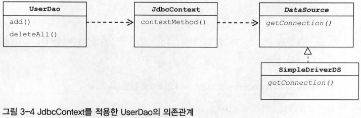
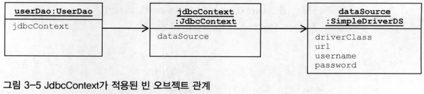
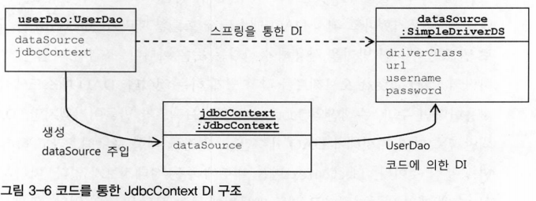

# 3장 템플릿

## 3.4 컨텍스트와 DI

### 3.4.1 JdbcContext의 분리

- 전략 패턴 구조로 보면 아래와 같음
    - UserDao 메소드가 클라이언트
    - 익명 내부 클래소 만들어지는 것이 개별적인 전략
    - jdbcContextWithStratementStrategy() 메소드는 컨텍스트
- 컨텍스트 메소드는 UserDao 내의 PreparedStatement를 실행하는 기능을 가진 메소드에서 공유 가능
    - jdbcContextWithStratementStrategy()는 다른 DAO에서도 사용 가능
    - UserDao 클래스 밖으로 독립시켜 모든 DAO가 사용 가능하도록 수정
- 스프링 DI는 기본적으로 인터페이스를 사이에 두고 의존 클래스를 바꿔서 사용하도록 하는게 목적
    - JdbcContext는 인터페이스인 DataSource와 다르게 구체 클래스
    - JdbcContext는 그 자체로 독립적인 JDBC 컨텍스트를 제공해주는 서비스 오브젝트로서 의미가 있을 뿐이고 구현 방법이 바뀔 가능성은 없음
    - 인터페이스를 구현하도록 만들지 않고, UserDao와 JdbcContext는 인터페이스를 사이에 두지 않고 DI를 적용하는 특별한 구조
    - 스프링 빈 설정은 클래스 레벨이 아니라 런타임 시에 만들어지는 오브젝트 레벨의 의존관계에 따라 정의

  
  

- JdbcContext를 UserDao로부터 완전히 분리, DI를 통해 연결될 수 있도록 설정함

### 3.4.2 JdbcContext의 특별한 DI

- 지금까지 적용했던 DI에서는 클래스 레벨에서 구체적인 의존관계가 만들어지지 않도록 인터페이스를 사용
    - 인터페이스를 적용했기 때문에 코드에서 직접 클래스를 사용하지 않아도 되고
    - 그 덕분에 설정을 변경하는 것만으로도 얼마든지 다양한 의존 오브젝트를 변경해서 사용할 수 있게 됨
- UserDao는 인터페이스를 거치지 않고 코드에서 바로 JdbcContext 클래스를 사용
    - userDao와 JdbcContext는 클래스 레벨에서 의존관계가 결정됨
    - 런타임 시에 DI 방식으로 외부에서 오브젝트를 주입해주는 방식을 사용했지만, 의존 오브젝트의 구현 클래스를 변경할 수 없음
    - 꼭 인터페이스로 뽑아내어 정의해두고 UserDao에서 사용하게 해야할 필요는 없음
- 스프링 빈으로 DI
    - DI라는 개념을 충실히 따르자면 인터페이스를 사이에 둬서 클래스 레벨에서는 의존관계가 고정되지 않게 하고,
        - 런타임 시에 의존할 오브젝트와의 관계를 주입해주는 것이 맞음
            - 인터페이스를 사용하지 않았다면 엄밀히 말해서 온전한 DI라고 볼 수 없음
    - **스프링의 DI는 넓게 보자면 객체의 생성과 관계설정에 대한 제어권한을 오브젝트에서 제거하고 외부로 위임했다는 IoC라는 개념을 포괄**
    - JdbcContext를 스프링을 이용해 UserDao 객체에서 사용하게 주입했다는 건 DI 기본을 따르고 있다고 볼 수 있음
    - 인터페이스를 사용해서 클래스를 자유롭게 변경할 수 있게 하지는 않았지만, JdbcContext를 UserDao와 DI 구조로 만들어야 할 이유
        - JdbcContext가 스프링 컨테이너의 싱글톤 레지스트리에서 관리되는 싱글톤 빈이 되기 때문
            - JdbcContext는 그 자체로 변경되는 상태정보를 갖고 있지 않음
            - dataSource는 읽기 전용이므로 JdbcContext가 싱글톤이 되는 데 아무런 문제가 없음
            - JdbcContext는 JDBC 컨텍스트 메소드를 제공해주는 일종의 서비스 오브젝트로서 의미가 있고
                - 싱글톤으로 등록돼서 여러 오브젝트에서 공유해 사용되는 것이 이상적
        - JdbcContext가 DI를 통해 다른 빈에 의존하고 있기 때문
            - JdbcContext는 dataSource 프로퍼티를 통해 dataSource 오브젝트를 주입받도록 되어 있음
            - DI를 위해서는 주입되는 오브젝트와 주입받는 오브젝트 양쪽 모두 스프링 빈으로 등록돼야 함
            - JdbcContext는 다른 빈을 DI 받기 위해서라도 스프링 빈으로 등록돼야 함
    - 중요한 것은 인터페이스의 사용 여부
        - 인터페이스가 없다는 것은 UserDao와 JdbcContext가 매우 긴밀한 관계를 가지고 강하게 결합되어 있다는 의미
        - UserDao는 항상 JdbcContext 클래스와 함께 사용돼야 함
        - 클래스는 구분되어 있지만 둘은 강한 응집도를 가짐
        - JDBC 방식 대신 JPA나 하이버네이트 같은 ORM을 사용해야 한다면 JdbcContext도 통째로 바뀌어야 함
    - 이런 클래스를 바로 사용하는 코드 구성을 DI에 적용하는 것은 가장 마지막 단계에서 고려해볼 사항
        - 인터페이스를 만들기 귀찮아서 클래스를 사용하자는 건 잘못된 생각
        - 원한다면 JdbcContext에 인터페이스를 두고 UserDao에서 인터페이스를 사용하도록 만들어도 문제될 것은 없음
- 코드를 이용하는 수동 DI
    - JdbcContext를 스프링의 빈으로 등록해서 UserDao에 DI하는 대신 사용하는 방법 → UserDao 내부에서 직접 DI를 적용하는 방법
        - 싱글톤으로 만드는 방법을 포기해야 함
        - DAO 개수만큼만 오브젝트 생성 필요 → JdbcContext 내부에 두는 상태 정보가 없으므로 메모리 주는 부담이 거의 없음
        - 스프링 빈으로 등록되지 않으므로 JdbcContext의 생성과 초기화를 책임져야 함
            - 자신이 사용할 오브젝트를 직접 만들고 초기화하는 방법을 사용
        - JdbcContext는 다른 빈을 인터페이스를 통해 간접적으로 의존
            - 다른 빈을 의존하고 있으면, 의존 오브젝트를 DI를 통해 제공받기 위해서라도 자신도 빈으로 등록되어야 함
        - JdbcContext 자신은 스프링의 빈이 아니므로 DI 컨테이너를 통해 DI 받을 수 없음
            - JdbcContext에 대한 제어권을 가지고 생성과 관리를 담당하는 UserDao에게 DI까지 맡기면 가능
                - 오브젝트를 생성하고 의존 오브젝트를 수정자 메소드로 주입하는 방식을 사용
                - UserDao가 임시로 DI 컨테이너처럼 동작하게 만들면 가능
            - JdbcContext에 주입해줄 의존 오브젝트인 DataSource는 userDao가 대신 DI 받도록 변경
            - UserDao는 주입받은 DataSource 빈을 JdbcContext를 만들고 초기화하는 과정에서만 사용하고 버림
    - 설정 방법
        - 스프링 설정파일에 userDao와 dataSource 두 개만 빈으로 정의
        - userDao 빈에 DataSource 타입 프로퍼티를 지정해서 dataSource 빈을 주입 받음
        - userDao가 JdbcContext 오브젝트를 만들면서 DI 받은 dataSource 오브젝트를 JdbcContext의 수정자 메소드로 주입
        - 만들어진 JdbcContext 오브젝트는 UserDao 인스턴스 변수에 저장해두고 사용
    - 장점
        - 굳이 인터페이스를 두지 않아도 될 만큼 긴밀한 관계를 갖는 DAO 클래스와 JdbcContext를 어색하게 따로 빈으로 분리하지 않고 내부에서 직접 만들어 사용하면서도 다른 오브젝트에 대한 DI를 적용할 수 있음
        - 한 오브젝트의 수정자 메소드에서 다른 오브젝트를 초기화하고 코드를 이용해 DI하는 것은 스프링에서도 종종 사용되는 기법

- 인터페이스를 사용하지 않고 DAO와 밀접한 관계를 갖는 클래스를 DI에 적용시키는 방법을 알아봄, 두 가지 모두 장단점이 있음
    1. 스프링의 DI를 이용하기 위해 빈으로 등록해서 사용하는 방법
        - 인터페이스를 사용하지 않는 클래스와의 의존관계
        - 오브젝트 사이의 실제 의존관계가 설정파일에 명확하게 드러난다는 장점
        - DI의 근본적인 원칙에 부합하지 않는 구체적인 클래스와의 관계가 설정에 직접 노출된다는 단점
    2. DAO 코드를 이용해 수동으로 DI를 하는 방법
        - JdbcContext가 UserDao의 내부에서 만들어지고 사용되면서 그 관계를 외부에 드러내지 않는다는 장점
            - 필요에 따라 내부에서 은밀히 DI를 수행하고 그 전략을 외부에 감출 수 있음
        - JdbcContext를 여러 오브젝트가 상요하더라도 싱글톤으로 만들 수 없고, DI 작업을 위한 부가적인 코드가 필요하다는 단점
- 일반적으로 어떤 방법이 나은지 말할 수 없음 → 상황에 따라 적절하다고 판단되는 방법을 선택해서 사용하면 됨
    - 왜 그렇게 선택했는지에 대한 분명한 이유와 근거가 있어야 함
    - 설명할 자신이 없다면 차라리 인터페이스를 만들어서 평범한 DI 구조로 만드는게 나을 수 있음
