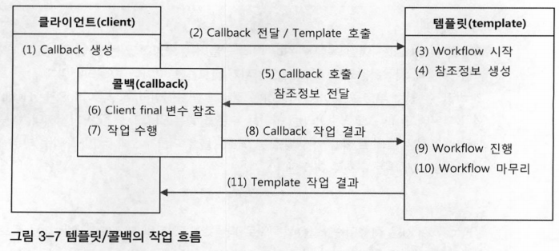
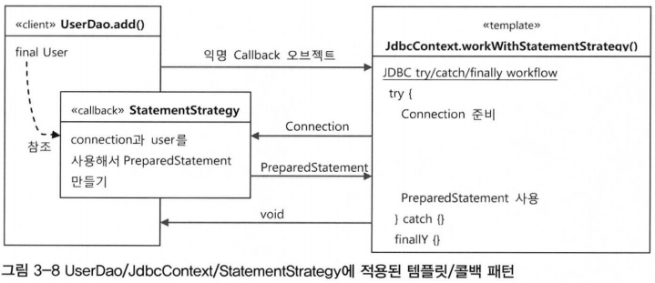

# 3장 템플릿

## 3.5 템플릿과 콜백

- 템플릿/콜백 패턴: 전략패턴의 기본 구조에 익명 내부 클래스를 활용한 방식
- **전략 패턴의 컨텍스트를 템플릿이라 부르고, 익명 내부 클래스로 만들어지는 오브젝트를 콜백이라고 부름**

- 템플릿(template)
    - 어떤 목적을 위해 미리 만들어둔 모양이 있는 틀
    - 고정된 틀 안에 바뀔 수 있는 부분을 넣어서 사용하는 경우 템플릿이라고 부름
    - 템플릿 메소드 패턴은 고정된 틀의 로직을 가진 템플릿 메소드를 슈퍼클래스에 두고 바뀌는 부분을 서브클래스의 메소드에 두는 구조
- 콜백(callback)
    - 실행되는 것을 목적으로 다른 오브젝트의 메소드에 전달되는 오브젝트
    - 파라미터로 전달되지만 값을 참조하기 위한 것이 아니라 특정 로직을 담은 메소드를 실행시키기 위해 사용
    - 자바에서는 메소드 자체를 파라미터로 전달할 방법이 없기 때문에 메소드가 담긴 오브젝트를 전달
    - functional object라고도 함

### 3.5.1 템플릿/콜백의 동작원리

- 템플릿은 고정된 작업 흐름을 가진 코드를 재사용한다는 의미에서 붙인 이름
- 콜백은 템플릿 안에서 호출되는 것을 목적으로 만들어진 오브젝트
- 템플릿/콜백 패턴의 콜백은 보통 단일 메소드 인터페이스를 사용, 템플릿의 작업 흐름 중 특정 기능을 위해 한 번 호출되는 경우가 일반적
- 콜백은 일반적으로 하나의 메소드를 가진 인터페이스를 구현한 익명 내부 클래스로 만들어짐
- 콜백 인터페이스의 메소드에 파라미터는 템플릿의 작업 흐름 중에 만들어지는 컨텍스트 정보를 전달받을 때 사용
- 템플릿/콜백 패턴의 일반적인 작업 흐름
    - 클라이언트의 역할은 템플릿 안에서 실행될 로직을 담은 콜백 오브젝트를 만들고, 콜백이 참조할 정보를 제공
        - 만들어진 콜백은 클라이언트가 템플릿의 메소드를 호출할 때 파라미터로 전달
    - 템플릿은 정해진 작업 흐름을 따라 작업을 진행하다가 내부에서 생성한 참조 정보를 가지고 콜백 오브젝트의 메소드를 호출
        - 콜백은 클라이언트 메소드에 있는 정보와 템플릿이 제공한 참조정보를 이용해서 작업을 수행하고 그 결과를 다시 템플릿에 돌려줌
    - 템플릿은 콜백이 돌려준 정보를 사용해서 작업을 마저 수행, 경우에 따라 최종 결과를 클라이언트에게 돌려줌
- DI 방식의 전략 패턴 구조, 클라이언트가 템플릿 메소드를 호출하면서 콜백 오브젝트를 전달하는 것은 메소드 레벨에서 일어나는 DI
- 템플릿이 사용할 콜백 인터페이스를 구현한 오브젝트를 메소드를 통해 주입해주는 DI 작업이 클라이언트가 템플릿 기능을 호출하는 것과 동시에 발생

  
  

- 템플릿/콜백의 고유한 특징
    - 템플릿/콜백 방식에서는 매번 메소드 단위로 사용할 오브젝트를 새롭게 전달받음
    - 콜백 오브젝트가 내부 클래스로서 자신을 생성한 클라이언트 메소드 내의 정보를 직접 참조
    - 클라이언트와 콜백이 강하게 결합된다는 면에서도 일반적인 DI와 다름
- 템플릿/콜백 방식은 전략 패턴과 DI의 장점을 익명 내부 클래스 사용 전략과 결합한 독특한 활용법
    - 템플릿/콜백을 하나의 고유한 디자인 패턴으로 기억

### 3.5.2 편리한 콜백의 재활용

- DAO 메소드에서 매번 익명 내부 클래스를 사용하기 떄문에 상대적으로 작성하고, 읽기가 불편함
- 복잡한 익명 내부 클래스의 사용을 최소화할 수 있는 방법
- 

### 3.5.3 템플릿/콜백의 응용