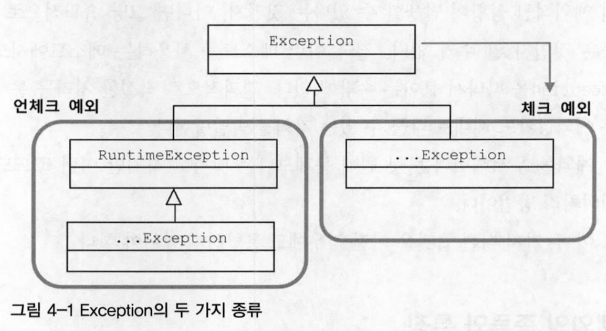

# 4장 예외

## 4.1 사라진 SQLException

- 자바 개발자가 가장 신경 쓰기 귀찮아하는 것 중의 하나가 예외처리
- 예외와 관련된 코드는 자주 엉망이 되거나 무성의하게 만들어지기 쉬움

### 4.1.1 초난감 예외코드

- 예외가 발생하면 catch 블록으로 잡아내는 것까지는 좋음
    - 아무것도 하지 않고 별 문제 없는 것처럼 넘어가 버리는 건 위험
    - 원치않는 예외가 발생하는 것보다도 훨씬 나쁜 일
    - 프로그램 실행 중에 예외가 발생하 → 그것을 무시하고 계속 진행해버리기 때문
    - 발생한 예외로 인해 어떤 기능이 비정상적으로 동작하거나, 메모리나 리소스가 소진되거나, 예상치 못한 다른 문제 발생
        - 시스템 오류가 발생 가능, 그 시스템 오류나 이상한 결과의 원인이 무엇인지 찾기 매우 힘듦
- **예외는 처리되어야 한다**
- 예외를 처리할 때 반드시 지켜야 할 핵심 원칙
    - 모든 예외는 적절하게 복구되든지 아니면 작업을 중단시키고 운영자 또는 개발자에게 분명하게 통보돼야 함
- SQLException이 발생하는 이유
    - SQL에 문법 에러가 있는 경우
    - DB에서 처리할 수 없을 정도로 데이터 액세스 로직에 심각한 버그가 있는 경우
    - 서버가 죽는 경우
    - 네트워크가 끊기는 경우 등의 심각한 상황이 발생이 벌어졌기 때문
- 예외를 무시하고 정상적으로 동작하고 있는 것처럼, 모른 척 다음 코드로 실행을 이어간다는 건 말이 되지 않음
- **예외를 무시하거나 잡아먹어 버리는 코드는 만들지 말아야 함**
- 기계적으로 메소드 선언에 `throws Exception`을 붙이는 개발자도 존재
    - 이런 메소드 선언에서는 의미 있는 정보를 얻을 수 없음
    - 해당 메소드를 사용하는 메소드에서도 역시 `throws Exception`을 따라 붙이는 수밖에 없음
    - 적절한 처리를 통해 복구될 수 있는 예외상황도 제대로 다룰 수 있는 기회를 박탈당함

### 4.1.2 예외의 종류와 특징

- 자바에서 throws를 통해 발생시킬 수 있는 예외는 크게 세가지가 존재
1. Error
    - java.lang.Error 클래스의 서브클래스들
    - 에러는 시스템에 뭔가 비정상적인 상황이 발생했을 경우 사용
    - 주로 자바 VM에서 발생시키는 것, 애플리케이션 코드에서 잡으려고 하면 안됨
    - 시스템 레벨에서 특별한 작업을 하는게 아니라면 애플리케이션에서는 이런 에러에 대한 처리는 신경쓰지 않아도 됨
2. Exception과 체크 예외
    - java.lang.Exception 클래스와 그 서브 클래스로 정의되는 예외들
    - 에러와 달리 개발자들이 만든 애플리케이션 코드의 작업 중에 예외상황이 발생했을 경우에 사용
    - Exception 클래스는 체크 예외(checked exception)와 언체크 예외(unchecked exception)로 구분
        - 체크 예외는 Exception 클래스의 서버클래스이면서 RuntimeException 클래스를 상속하지 않은 것들
        - 언체크 예외는 RuntimeException을 상속한 클래스들

    

    - RuntimeException은 Exception의 서브클래스이므로 Exception의 일종
    - **자바는 RuntimeException과 서브클래스는 특별하게 다룸**
    - 일반적으로 예외라고하면 체크 예외라고 생각
        - Exception 클래스의 서브클래스 중, RuntimeException을 상속하지 않은 것
    - 체크 예외가 발생할 수 있는 메소드를 사용할 경우 반드시 예외를 처리하는 코드를 함께 작성해야 함
    - 사용할 메소드가 체크 예외를 던진다면 이를 catch문으로 잡거나 throws를 정의해서 메소드 밖으로 던짐
        - 그렇지 않으면 컴파일 에러 발생
    - 자바 언어와 JDK 초기 설계자들은 체크 예외를 발생 가능한 예외에 모두 적용하려고 했던 것 같음
        - 예외적인 상항에서 던져질 가능성이 있는 것들 대부분이 체크 예외로 만들어짐
3. RuntimeException과 언체크/런타임 예외
    - java.lang.RuntimeException 클래스를 상속한 예외들은 예외처리를 강제하지 않기 때문에 언체크 예외라고 불림
        - 대표 클래스 이름을 따서 런타임 예외라고도 불림
    - 에러와 마찬가지로 런타임 예외는 catch문으로 잡거나 throws로 선언하지 않아도 됨
        - 명시적으로 잡거나 throws로 선언해줘도 상관 없음
    - 런타임 예외는 주로 프로그램의 오류가 있을 때 발생하도록 의도된 것들
    - 코드에서 미리 조건을 체크하도록 주의 깊게 만든다면 피할 수 있음
        - 피할 수 있지만 개발자가 부주의해서 발생할 수 있는 경우에 발생하도록 만든 것이 런타임 예외
    - **예상하지 못했던 예외상황에서 발생하는 게 아니기 때문에 굳이 catch나 throws를 사용하지 않아도 되도록 만듦**
- 자바 언어와 JDK 설계자들의 설계의도는 현실과 잘 맞지 않았다고 비난의 대상이 되기도 함
    - 체크 예외가 예외처리를 강제하는 것 때문에 예외 블랙홀이나 무책임한 throws 코드가 남발됨
    - 최근 자바 스펙의 API들은 예상 가능한 예외상황을 다루는 예외를 체크 예외로 만들지 않는 경향이 있음

### 4.1.3 예외처리 방법

- 예외처리 방법 1: 예외 복구
    - **예외상황을 파악하고 문제를 해결해서 정상 상태로 돌려놓는 방법**
    - 예외로 인해 기본 작업 흐름이 불가능하면 다른 작업 흐름으로 자연스럽게 유도
        - 예외상황은 다시 정상으로 돌아오고 예외를 복구했다고 볼 수 있음
        - 예외가 처리되면 비록 기능적으로는 사용자에게 예외상황을 비쳐도 애플리케이션에서는 정상적으로 설계된 흐름을 따라 진행
        - ex) 네트워크 접속이 원할하지 않아서 예외가 발생 시
            - 일정 시간 대기했다가 다시 접속을 시도해보는 방법을 사용해서 예외 상황으로부터 복구를 시도할 수 있음
            - 정해진 횟수만큼 재시도해서 실패 시 → 예외 복구 포기
    - 예외처리 코드를 강제하는 체크 예외의 경우
        - 예외를 어떤 식으로든 복구할 가능성이 있는 경우 사용
        - API를 사용하는 개발자로 하여금 예외 상황이 발생할 수 있음을 인식하도록 도와주고 적절한 처리를 시도해보록 요구함
- 예외처리 방법 2: 예외 회피
    - **예외처리를 자신이 담당하지 않고 자신을 호출한 쪽으로 던지는 방법**
        - throws 문을 선언해서 예외가 발생하면 알아서 던져지게 함
        - catch문으로 예외를 잡은 후에 로그를 남기고 다시 예외를 던짐 (rethrow)
    - 예외를 자신이 처리하지 않고 회피하는 방법
    - 예외처리를 회피하려면 반드시 다른 오브젝트나 메소드가 예외를 대신 처리할 수 있도록  던져줘야 함
    - JdbcContext나 JdbcTemplate이 사용하는 콜백 오브젝트는 ResultSet이나 PareparedStatement 등을 이용
        - 작업 중 발생하는 SQLException을 자신이 처리하지 않고 템플릿으로 던져버림
        - 콜백 오브젝트의 메소드는 SQLException에 대한 예외를 회피하고 템플릿 레벨에서 처리하도록 던짐
    - 콜백과 템플릿처럼 긴밀하게 역할을 분담하고 있는 관계가 아닐 경우
        - 자신의 코드에서 발생하는 예외를 그냥 던저벼리는 건 무책임한 책임회피일 수 있음
        - throws SQLException과 같이 구체적인 예외를 던지도록 선언하기 귀찮아짐
            - 그로인해 모든 예외를 생각없이 던져버리게 하는 throws Exception을 사용할 가능성이 높음
    - **예외를 회피하는 것은 예외를 복구하는 것처럼 의도가 분명해야 함**
        - 콜백/템플릿처럼 긴말한 관계에 있는 다른 오브젝트에서 예외처리 책임을 분명하게 지게함
        - 자신을 사용하는 쪽에서 예외를 다루는 게 최선의 방법이라는 분명한 확신이 있어야 함
- 예외처리 방법 3: 예외 전환
    - 예외 회피와 비슷하게 예외를 복구해서 정상적인 상태로는 만들 수 없기 때문에 예외를 메소드 밖으로 던짐
    - **예외 회피와 달리 발생한 예외를 그대로 넘기는 게 아니라 적절한 예외로 전환해서 던진다는 특징**
    - 예외 전환의 목적
        1. 내부에서 발생한 예외를 그대로 던지는 것이 그 예외 상황에 대한 적절한 의미를 부여해주지 못하는 경우
            - 의미를 분명하게 해줄 수 있는 예외로 바꿔주기 위해
            - API가 발생하는 기술적인 로우레벨을 상황에 적합한 의미를 가진 예외로 변경
            - 의미가 분명한 예외가 던져지면 서브스 계층 오브젝트에는 적절한 복구 작업을 시도할 수 있음
            - 서비스 계층 오브젝트에서 SQLException의 원인을 해석해서 대응하는 것도 불가능하지 않음
            - 특정 기술의 정보를 해석하는 코드를 비즈니스 로직에 담은 서비스 계층에 두는 것은 매우 어색
            - DAO 메서드에서 기술에 독립적이며 의미가 분명한 예외로 전환해서 던져줄 필요가 있음
            - 보통 전환하는 예외에 원래 발생한 예외를 담아서 중첩 예외로 만드는 것이 좋음
                - 중첩 예외는 `getCause()` 메소드를 이용해서 처음 발생한 예외가 무엇인지 확인 가능
                - 중첩 예외는 새로운 예외를 만들면서 생성자나 `initCause()` 메소드로 근본 원인이 되는 예외를 넣어주면 됨
                    ```java
                    catch(SQLException e) {
                        // 생성자
                        throw DuplicateUserIdException(e);
                        
                        // 메소드로 근본 원인 예외 추가
                        throw DuplicateUserIdException().initCause(e);
                    }
                    ```
        2. 예외를 처리하기 쉽고 단순하게 만들기 위해 포장하는 경우
            - 중첩 예외를 이용해 새로운 예외를 만들고, 원인이 되는 예외를 내부에 담아서 던지는 방식은 같음
            - 의미를 명확하게 하려고 다른 예외로 전환하는 것이 아님
            - **주로 예외처리를 강제하는 체크 예외를 언체크 예외인 런타임 예외로 바꾸는 경우에 사용**
            - 애플리케이션 로직상에서 예외조건이 발견되거나 예외상황이 발생할 수도 있음
                - API가 던지는 예외가 아니라 애플리케이션 코드에서 의도적으로 던지는 예외
                - 체크 예외를 사용하는 것이 적절
                - 비지니스 적인 의미가 있는 예외는 이에 대한 적절한 대응이나 복구 작업이 필요
            - 일반적으로 체크 예외를 계속 throws를 사용해 넘기는 것은 무의미함
                - 메소드 선언은 지저분해지고 아무런 장점이 없음
                - 복구가 불가능한 예외라면 가능한 빨리 런타임 예외로 포장해 던지게 함
                    - 다른 계층의 메소드를 작성할 때 불필요한 throws 선언이 들어가지 않도록 해줌
            - 대부분 서버환경에서는 애플리케이션 코드에서 처리하지 않고 전달된 예외들을 일괄적으로 다룰 수 있는 기능을 제공
            - 복구하지 못할 예외인 경우
                - 에플리케이션 코드에서는 런타임 예외로 포장해서 던짐
                - 예외 처리 서비스등을 이용해 자세한 로그를 남김
                - 관리자에게는 메일 등으로 통보
                - 사용자에게는 친절한 안내 메시지를 보여주는 식으로 처리

### 4.1.4 예외처리 전략

- 자바의 예외를 이용하는 것은 간단함
- 예외를 효과적으로 사용하고, 예외가 발생하는 코드를 깔끔하게 정리하는 데는 여러가지 신경써야 할 사항이 많음
- 일반적으로 체크 예외가 일반적인 예외를 다룸, 언체크 예외는 시스템 장애나 프로그램 상의 오류에 사용
- 체크 예외에는 복구 가능성이 조금이라도 있는 예외적인 상황이기 때문에 자바는 이를 처리하는 catch블록이나 throws 선언을 강제함
    - 예외처리를 강제하는 것은 예외가 발생할 가능성이 있는 API 메소드를 사용하는 개발자의 실수를 방지하기 위한 배려
    - 예외를 제대로 다루고 싶지 않을만큼 짜증나게 만드는 원인이 되기도 함
- 독립형 애플리케이션과 달리 서버의 특정계층에서 예외가 발생했을 경우
    - 작업을 일시 중지하고 사용자와 바로 커뮤니케이션하면서 예외상황을 복구할 수 있는 방법이 없음
    - 차라리 애플리케이션 차원에서 예외상황을 미리 파악하고 예외가 발생하지 않도록 차단하는 것이 좋음
- 프로그램의 오류나 외부 환경으로 인해 예외가 발생하는 경우
    - 빨리 해당 요청의 작업을 취소하고 서버 관리자나 개발자에게 통보해주는 편이 좋음
    - 자바의 환경이 서버로 이동하면서 체크 예외의 활용도와 가치는 점점 떨어짐
    - 대응이 불가능한 체크 예외라면 빨리 런타임 예외로 전환해서 던지는 게 나음
- 자바의 예전 버전에는 복구할 가능성이 조금이라도 있다면 체크 예외로 만듦
    - 지금은 항상 복구할 수 있는 예외가 아니라면 일단 언체크 예외로 만드는 경향 있음
- 언체크 예외라도 필요하다면 얼마든지 catch 블록으로 잡아서 복구하거나 처리 가능
    - 대게는 복구 불가능한 상황이고, RuntimeException 등으로 포장해서 던져야함
    - 아예 API 차원에서 런타임 예외를 던지도록 만듦
- 어디에서든 DuplicationUserIdException을 잡아서 처리할 수 있다면 굳이 체크 예외로 만들지 않고 런타임 예외로 만드는 게 나음
    - 대신 add() 메소드는 명시적으로 DuplicationUserIdException을 던진다고 선언해야 함
    - add()메소드를 사용하는 코드를 만드는 개발자에게 의미있는 정보를 전달 가능
    - 런타임 예외도 throws로 선언할 수 있음
- 필요하면 언제든 잡아서 처리할 수 있도록 별도의 예외로 정의
    - 필요 없다면 신경 쓰지 않아도 되도록 RuntimeExcetpion을 상속한 런타임 예외로 만듦
    - 중첩 예외를 만들 수 있도록 생성자 추가 필요!
    - 메시지나 예외 상황을 전달하는 데 필요한 정보를 더 넣을 수 있음
        ```java
        public class DuplicateUserIdException extends RuntimeException {
            public DuplicateUserIdException(Throwable cause) {
                super(cause);
            }
        }
        ```
- 런타임 예외를 일반화해서 사용하는 방법은 장점이 많음
    - 런타임 예외로 만들었기 때문에 사용에 더 주의를 기울일 필요도 있음
    - 컴파일러가 예외처리를 강제하지 않으므로 신경쓰지 않으면 예외상황을 충분히 고려하지 않을 수도 있기 때문
- 런타임 예외 중심의 전략 → 낙관적인 예외처리 기법
- 복구할 수 있는 예외는 없다고 가정하고, 예외가 생겨도 런타임 예외이므로 시스템 레벨에서 알아서 처리해줌
    - 꼭 필요한 경우 런타임 예외라도 잡아서 복구하거나 대응 가능하므로 문제될 것 없다는 낙관적인 태도를 기반으로 함
    - 일단 잡고 보도록 강제하는 체크 예외의 비관적인 접근 방법과 대비
- 애플리케이션 예외
    - 시스템 또는 외부의 예외상황이 원인이 아니라 애플리케이션 자체의 로직에 의해 의도적으로 발생시킴
    - 반드시 catch해서 무엇인가 조치를 취하도록 요구하는 예외
    - 애플리케이션 예외 기능을 담은 메소드를 설계하는 방법
        - 정상 로직의 경우와 예외 상황이 발생했을 경우에 각각 다른 종류의 리턴값을 돌려줌
            - 예외 상황에 대한 리턴 값을 명확하게 코드화하고 잘 관리하지 않으면 혼란이 생김
            - 결과 값을 확인하는 조건문이 자주 등장함
        - 정상적인 흐름을 따르는 코드는 그대로 두고 예외적인 상황에서는 비즈니스적인 의미를 띤 예외를 던지도록 만듦
            - 예외 상황을 처리하는 catch 블록을 메소드 호출 직후에 둘 필요 없음
            - 사용하는 예외는 의도적으로 체크 예외로 만듦, 자주 발생 가능한 예외상황에 대한 로직을 구현하도록 강제함
            - 기본적으로 런타임 예외로 만들어두는 것보다는 상대적으로 안전함

### 4.1.5 SQLException은 어떻게 됐나?

- 예외처리에 대한 내용은 JdbcTemplate을 적용하는 중에 throws SQLException 선언이 왜 사라졌는가를 설명하는 데 필요한 것
    - 스프링의 예외처리 전략과 원칙을 알고 있어야 하기 때문
- DAO에 존재하는 SQLException에 대해 고민
    - 99%의 SQLException은 코드 레벨에서는 복구할 방법이 없음
        - 프로그램의 오류 or 개발자의 부주의 때문에 발생하는 경우, 통제할 수 없는 외부상황 때문에 발생
    - 시스템의 예외라면 애플리케이션 레벨에서 복구할 방법이 없음
    - 애플리케이션 코드의 버그나 다루지 않은 범위를 벗어난 값 때문에 발생한 예외도 복구할 방법이 없음
    - 예외처리 전략을 적용해야 함
    - 필요없는 기계적인 throws 선언이 등장하도록 방치하지 말고, 가능한 빨리 언체크/런타임 예외로 전환해줘야 함
- 스프링 JdbcTemplate은 예외처리 전략을 따름
    - JdbcTemplate 템플릿과 콜백 안에서 발생하는 모든 SQLException을 런타임 예외인 DataAccessException으로 포장해서 던짐
    - JdbcTemplate을 사용하는 UserDao 메소드에선 꼭 필요한 경우에만 런타임 예외인 DataAccessException을 잡아 처리
    - 그외의 경우에는 무시 → DAO 메소드에서 SQLException이 모두 사라짐
- DataAccessException이 런타임 예외이므로 update()를 사용하는 메소드에서 이를 잡거나 다시 던질 의무는 없음
- 스프링의 API 메소드에 정의되어 있는 대부분의 예외는 런타임 예외
    - 발생가능한 예외가 있다고 하더라도 이를 처리하도록 강제하지 않음