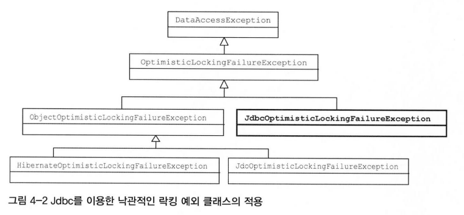
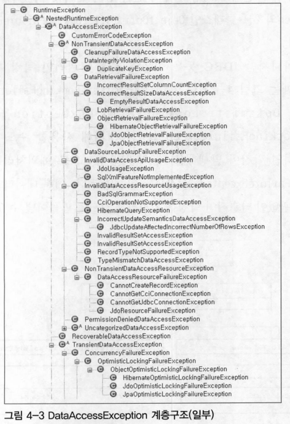
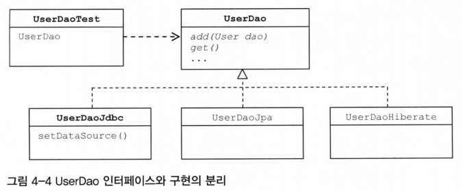

# 4장 예외

## 4.2 예외 전환

- 예외 전환의 목적
    - 런타임 예외로 포장해서 굳이 필요하지 않은 catch/throws를 줄여줌
    - 로우레벨의 예외를 좀 더 의미있고 추상화된 예외로 바꿔서 던져주는 것
- 스프링의 JdbcTemplate이 던지는 DataAccessException은 런타임 예외로 SQLException을 포장해주는 역할
- 대부분 복구가 불가능한 예외인 SQLException에 대해 애플리케이션 레벨에서는 신경 쓰지 않도록 해줌
- SQLException에 담긴 다루기 힘든 상세한 예외정보
    - DataAccessException으로 의미있고 일관성 있는 예외로 전환해서 추상화해주려는 용도로 사용

### 4.2.1 JDBC의 한계

- JDBC는 자바를 이용해 DB에 접근하는 방법을 추상화된 API형태로 정의
    - 각 DB 업체가 JDBC 표준을 따라 만들어진 드라이버를 제공
- 내부 구현은 DB마다 다르겠지만 표준 인터페이스를 통해 그 기능을 제공해줌
- DB 종류에 상관없이 사용할 수 있는 데이터 액세스 코드를 작성하는 일은 쉽지 않음
    - DB를 자유롭게 변경해서 사용할 수 있는 유연한 코드를 보장해주지는 못함
- 현실적으로 DB를 자유롭게 바꾸어 사용할 수 있는 DB 프로그램을 작성하는데 걸림돌
    1. 비표준 SQL
        - 대부분의 DB는 표준을 따르지 않는 비표준 문법과 기능을 제공
        - 비표준 SQL은 결국 DAO 코드에 들어가고, 해당 DAO는 특정 DB에 종속적인 코드가 됨
            - DB 변경 가능성을 고려해서 유연하게 만들어야 한다면 SQL은 큰 걸림돌
        - 표준 SQL만 사용할 경우, 페이징 쿼리부터 문제가 됨
        - 해결 방안
            - DAO를 DB별로 만들어 사용
            - SQL을 외부에서 독립시켜서 바꿔 쓸 수 있게 하는 것
    2. 호환성 없는 SQLException의 DB 에러정보
        - DB를 사용하다가 발생할 수 있는 예외의 원인은 다양
        - JDBC는 데이터 처리 중에 발생하는 다양한 예외를 SQLException 하나에 모두 담음
        - 예외가 발생한 원인은 SQLException 안에 담긴 에러 코드와 SQL 상태 정보를 참조해야 함
            - SQLException의 getErrorCode()로 가져올 수 있는 DB에러 코드는 DB별로 모두 다름
            - DB 벤더가 정의한 고유한 에러 코드를 사용하기 때문
            - SQLException은 예외가 발생했을 때의 DB 상태를 담은 SQL 상태정보를 부가적으로 제공
                - SQLException이 상태 코드를 제공하는 이유는 DB에 독립적인 에러정보를 얻기 위해서
                - 하지만 DB의 JDBC 드라이버에서 SQLException을 담을 상태 코드를 정확하게 만들어주지 않음
                - SQL 상태 코드를 믿고 결과를 파악하도록 코드를 작성하는 것은 위험
        - 호환성 없는 에러 코드와 표준을 잘 따르지 않는 상태 코드를 가진 SQLException만으로 해결 안됨
            - DB에 독립적인 유연한 코드 작성 어려움

### 4.2.2 DB 에러 코드 매핑을 통한 전환

- SQLException에 담긴 SQL 상태 코드는 신뢰할만하지 않으므로 고려하지 않음
- DB 에러 코드는 DB에서 직접 제공하여 버전이 올라가더라도 어느정도 일관성이 유지
    - 문제는 DB마다 에러코드가 제각각임
- JdbcTemplate은 SQLException을 런타임 예외인 DataAccessException으로 단순히 포장하는 것이 아님
    - DB 에러 코드를 DataAccessException 계층구조의 클래스 중 하나로 매핑
    - 전환되는 JdbcTemplate에서 던지는 예외는 모두 DataAccessException의 서브클래스 타입
    - DB가 달라져도 같은 종류의 에러아면 동일한 예외를 받을 수 있음
- JdbcTemplate을 이용 시, JDBC에서 발생하는 DB 관련 예외는 거의 신경 쓰지 않아도 됨
- 애플리케이션에서 직접 정의한 예외를 발생시키고 싶을 경우
    - 스프링의 예외를 전환해주는 코드를 DAO 안에 넣음
        ```java
        public void add() throws DuplicateUserIdException {
            try {
                // JdbcTemplate을 이용해 User add 코드
            } catch(DuplicateKeyException e) {
                // 로그를 남기 등의 필요한 작업
                throw new DuplicateUserIdException(e);
            }
        }
        ```
- 스프링의 에러코드 매핑을 통한 DataAccessException 방식을 사용하는 것이 이상적임

### 4.2.3 DAO 인터페이스와 DataAccessException 계층구조

- DataAccessException
    - JDBC의 SQLException을 전환하는 용도로 만들어진 건 아님
    - JDBC 외의 자바 데이터 액세스 기술에서 발생하는 예외에도 적용
    - 의미가 같은 예외라면 데이터 액세스 기술의 종류와 상관없이 일관된 예외가 발생하도록 만들어줌
    - 데이터 액세스 기술에 독립적인 추상화된 예외를 제공
- DAO를 굳이 따로 만들어 사용하는 이유
    - **데이터 액세스 로직을 담은 코드를 성격이 다른 코드에서 분리해놓기 위함**
    - 분리한 DAO는 전략 패턴을 적용해 구현 방법을 변경해서 사용할 수 있게 만들기 위함
    - DAO는 인터페이스를 사용해 구체적인 클래스 정보와 구현 방법을 감추고, DI를 통해 제공되도록 만드는 것이 바람직함
- 인터페이스로 메소드의 구현은 추상화했지만, 구현 기술마다 던지는 예외가 다르기 때문에 메소드의 선언이 달라진다는 문제 발생
- DAO 인터페이스를 기술에 완전히 독립적으로 만들려면 예외가 일치하지 않는 문제도 해결해야 함
- 가장 단순한 해결 방법은 모든 예외를 다 받아주는 throws Exception으로 선언 → 간단하지만 무책임한 선언
    - JDBC보다 늦게 등장한 JDO, Hibernate, JPA 등의 기술은 SQLException 같은 체크 예외 대신 런타임 예외를 사용
    - 따라서 throws에 선언을 해주지 않아도 됨
    - JDBC를 이용한 DAO에서 모든 SQLException을 런타임 예외로 포장가능
- 대부분의 데이터 액세스 예외는 애플리케이션에서는 복구 불가능하거나 할 필요가 없음
    - 모든 예외를 다 무시해야 하는 건 아님
    - 중복 키 에러처럼 비즈니스 로직에서 의미 있게 처리할 수 있는 예외도 존재
- 애플리케이션에서는 사용하지 않더라도 시스템 레벨에서 데이터 액세스 예외를 의미있게 분류할 필요도 있음
- 데이터 액세스 기술이 달라지면 같은 상황에서도 다른 종류의 예외가 던져짐
    - DAO를 사용하는 클라이언트 입장에서는 DAO의 사용 기술에 따라 예외 처리 방법이 달라져야 함
    - 클라이언트가 DAO의 기술에 의존적이 될 수 밖에 없음
    - 인터페이스로 추상화하고 일부 기술에서 발생하는 체크 예외를 런타임 예외로 전환하는 것만으론 불충분
- **스프링은 자바의 다양한 데이터 액세스 기술을 사용할 때 발생하는 예외들을 추상화해서 DataAccessException 계층구조 안에 정리**
- DataAccessException은 자바 주요 데이터 액세스 기술에서 발생할 수 있는 대부분의 예외를 추상화함
    - 데이터 액세스 기술에 상관없이 공통적인 예외도 있지만, 일부 기술에서만 발생하는 예외도 존재
    - 일부 기술에서만 공통적으로 나타나는 예외를 포함해서 데이터 액세스 기술에서 발생 가능한 대부분의 예외를 계층 구조로 분류
    - JDO, JPA, 하이버네이트처럼 오브젝트/엔티티 단위로 정보를 업데이트하는 경우에는 낙관적인 락킹이 발생
        - 스프링의 예외 전환 방법을 사용하면 기술에 상관없이 해결 가능
            - DataAccessException의 서브 클래스인 ObjectOptimisticLockingFailureException으로 통일
        - 어떤 데이터 액세스 기술을 사용했을지에 상관없이 낙관적인 락킹을 처리하는 코드를 만들어낼 수 있음
    - DataAccessException 계층 구조에는 템플릿 메소드나 DAO 메소드에서 직접 활용할 수 있는 예외도 정의
- JdbcTemplate과 같이 스프링의 데이터 액세스 지원기술을 이용해 DAO를 만들 경우
    - 사용 기술에 독립적인 일관성 있는 예외를 던질 수 있음

<p align="center">
  
  
</p>


### 4.2.4 기술에 독립적인 UserDao 만들기

- 보통 빈의 이름은 클래스 이름이 아니라, 클래스의 구현 인터페이스 이름을 따른 경우가 일반적
    - 나중에 구현 클래스를 바꿔도 혼란이 없기 때문
- @Autowired는 스프링의 컨텍스트 내에서 정의된 빈 중에서 인스턴스 변수에 주입 가능한 타입의 빈을 찾아줌
    - UserDaoJdbc 오브젝트는 UserDao 타입
- 중요한 건 테스트의 관심
    - 구현 기술에 상관없이 DAO의 기능이 동작하는 데만 관심이 있다면, UserDao 인터페이스로 받아서 테스트하는 편이 나음
    - 다른 데이터 액세스 기술로 DAO 빈을 변경한다고 하더라도 이 테스트는 여전히 유효
    - 특정 기술을 사용한 UserDao의 구현 내용에 관심을 가지고 테스트하면 인터페이스가 아닌 특정 타입을 사용해야 함

- USerDao의 인터페이스와 구현을 분리함으로써 데이터 액세스의 구체적인 기술과 UserDao의 클라이언트 사이의 DI가 적용된 모습



- 데이터 액세스 기술을 하이버네이트나 JPA를 사용했을 때도 동일한 예외가 발생할 것으로 기대하지만 실제로 다른 예외가 던져짐
    - 이유: SQLException에 담긴 DB의 에러 코드를 바로 해석하는 JDBC의 경우와 다름
        - JPA나 하이버네이트, JDO 등에서는 각 기술이 재정의한 예외를 가져와 스프링이 최종적으로 DataAccessException으로 변환
        - DB의 에러 코드와 달리 이런 예외들을 세분화되어 있지 않기 때문
- DataAccessException이 기술에 상관없이 어느 정도 추상화된 공통 예외로 변환해줌
    - 근본적인 한계 때문에 완벽하다고 기대할 수 없음
    - 사용에 주의를 기울여야 함
- DAO에서 사용하는 기술의 종류와 상관없이 동일한 예외를 얻고 싶은 경우
    - DuplicatedUserIdException처럼 직접 예외를 정의하고, 각 DAO의 add()메소드에 좀 더 상세한 예외 전환을 해줄 필요가 있음
    - 하이버네이트 예외의 경우라도 중첩된 예외로 SQLException 이 전달되기 때문
        - 다시 스프링의 JDBC 예외 전환 클래스의 도움을 받아 처리 가능
- JDBC 외의 기술을 사용할 때도 DuplicateKeyException을 발생시키려면 SQLException을 가져와 직접 예외를 전환 가능
- JDBC를 이용하지만 JdbcTemplate과 같이 자동으로 예외를 전환해주는 스프링의 기능 사용할 수 없는 경우
    - SQLException을 그대로 두거나 의미없는 RuntimeException으로 뭉뚱그려서 던지는 대신
    - 스프링의 DataAccessException 계층의 예외로 전환 가능

## 4.3 정리

- 예외를 잡아서 아무런 조취를 취하지 않거나 의미없는 throws 선언을 남발하는 것은 위험
- 예외는 복구하거나, 예외처리 오브젝트로 의도적으로 전달하거나, 적절한 예외로 전환해야 함
- 두 가지 예외 전환 방법
    - 좀 더 의미있는 예외로 변경
    - 불필요한 catch/throws를 피하기 위해 런타임 예외로 포장
- 복구할 수 없는 예외는 가능한 빨리 런타임 예외로 전환하는 것이 바람직함
- 애플리케이션의 로직을 담기 위한 예외는 체크 예외로 만듦
- JDBC의 SQLException은 대부분 복구할 수 없는 예외이므로 런타임 예외로 포장해야 함
- SQLException의 에러 코드는 DB에 종속되기 때문에 DB에 독립적인 예외로 전환될 필요가 있음
- 스프링은 DataAccessException을 통해 DB에 독립적으로 적용 가능한 추상화된 런타임 예외 계층을 제공
- DAO를 데이터 액세스 기술에서 독립시키려면 인터페이스 도입과 런타임 예외 전환, 기술에 독립적인 추상화된 예외로 전환이 필요